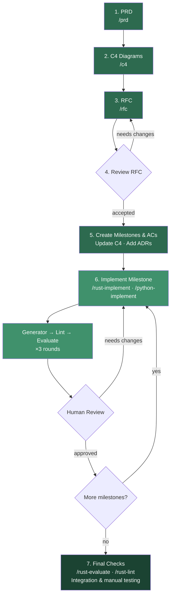

<p align="center">
  
</p>

# Bayanay

> [!WARNING]
> **This repository is highly experimental.** It changes frequently — potentially multiple times a day — and may introduce unexpected breaking changes at any time. If you need stability, fork the repo and update at your own pace.

A collection of [Claude Code plugins](https://docs.anthropic.com/en/docs/claude-code/plugins) for software engineering — code generation, evaluation, linting, architecture, and research across multiple languages and tools.

Each plugin adds slash-command skills, specialized agents, and curated reference guidelines that Claude Code loads contextually based on what you're working on.

## Plugins

| Plugin                            | Description                                                          |
|-----------------------------------|----------------------------------------------------------------------|
| **[rust](plugins/rust)**          | Rust code generation, evaluation, linting, docs, and research        |
| **[python](plugins/python)**      | Python code generation, evaluation, linting, and research            |
| **[terraform](plugins/terraform)**| Terraform code generation, evaluation, linting, and research         |
| **[software](plugins/software)**  | Language-agnostic software architecture — ADRs, C4 diagrams, RFCs   |
| **[general](plugins/general)**    | General-purpose utilities — Mermaid diagrams, PRDs, [caveman mode](https://github.com/sublayerapp/caveman) — heavily inspired by the original, particularly useful for creating concise skills, rules, and guidelines |

> [!WARNING]
> The Python and Terraform plugins were LLM-generated based on an earlier iteration of the Rust plugin and have not been tested in real workflows yet. They are highly likely to produce poor results in their current state. The Rust plugin is the only battle-tested one.

## Installation

First, add this repository as a marketplace:

```bash
claude plugin marketplace add mcuste/bayanay
```

Then install any plugin:

```bash
# User-wide (available in all projects)
claude plugin install rust@bayanay

# Or project-scoped
claude plugin install rust@bayanay --scope project
```

Repeat for each plugin you want.

## How it works

### Skills

Each plugin provides slash-command skills that orchestrate multi-step workflows. For example, `/rust-implement` runs a full TDD loop: designs tests, generates implementation, evaluates against guidelines, and fixes violations.

### Agents

Plugins can include specialized agents (`rust-generator`, `python-evaluator`, etc.) that Claude Code spawns for parallelizable subtasks like code review or repository-wide audits.

### Guideline tiers

The Rust and Python plugins use a layered guideline system so the right rules load at the right time:

- **Activity-scoped** — loaded by the generator/evaluator when the task matches (e.g. type design, error handling, concurrency, testing, performance)
- **Domain-scoped** — loaded automatically when matching dependencies are detected in your project (e.g. Axum, Clap, Bevy, WASM for Rust; or specific cloud/DB/ML packages for Python and Terraform)

## Workflow

A typical project lifecycle using Bayanay plugins, from inception to delivery:



**Steps:**

1. **Generate PRD** — Brainstorm with Claude over a document, note, or prototype, then run `/prd` to capture product requirements
2. **Generate C4 diagrams** — Run `/c4` to produce System Context and Container diagrams (add Component level for complex systems). Brainstorm beforehand if needed
3. **Draft RFC** — Brainstorm the feature, then run `/rfc` to propose the technical approach
4. **Review RFC** — Read, correct, and iterate until the RFC is solid before accepting
5. **Plan milestones** — Break the RFC into granular milestones with acceptance criteria. Update C4 diagrams and add ADRs (`/adr`) to record architecture decisions
6. **Implement per milestone** — Call the language-specific orchestrator (`/rust-implement`, `/python-implement`) for each milestone. Each run loops through generate → lint → evaluate three times. Review each result yourself
7. **Final validation** — Run evaluation and linting tools manually (`/rust-evaluate`, `/rust-lint`), plus integration tests and manual testing for completeness

## Repository layout

```
plugins/
  <plugin-name>/
    .claude-plugin/plugin.json   # Plugin metadata
    skills/                      # Slash-command skill definitions
      <skill-name>/
        skill.md                 # Skill prompt
        references/              # Guidelines and decision trees
    agents/                      # Specialized agent definitions
    README.md                    # Plugin-specific docs
evals/
  <plugin-name>/
    <skill-name>/
      fixtures/                  # Test inputs for skill evaluation
      workspace/                 # Workspace used by skill-creator
```

## Why "Bayanay"?

In Yakut (Sakha) mythology, **Bayanay** is the spirit of forests, animals, and patron of hunters. The name comes from roots meaning *wealth, richness, and divinity*. Hunters light fires and pray to Bayanay before setting out, asking for a safe and fertile hunt. Instead of dogs, Bayanay keeps wild wolves — and can send them to bestow generous prey on those who earn favor.

Same energy here. You're hunting for good code, and the skills and agents are the wolves Bayanay sends to help you get there. Just type a slash command instead of lighting a fire.

*P.S. Sometimes LLMs help me with finding out/learning cool stuff.*
