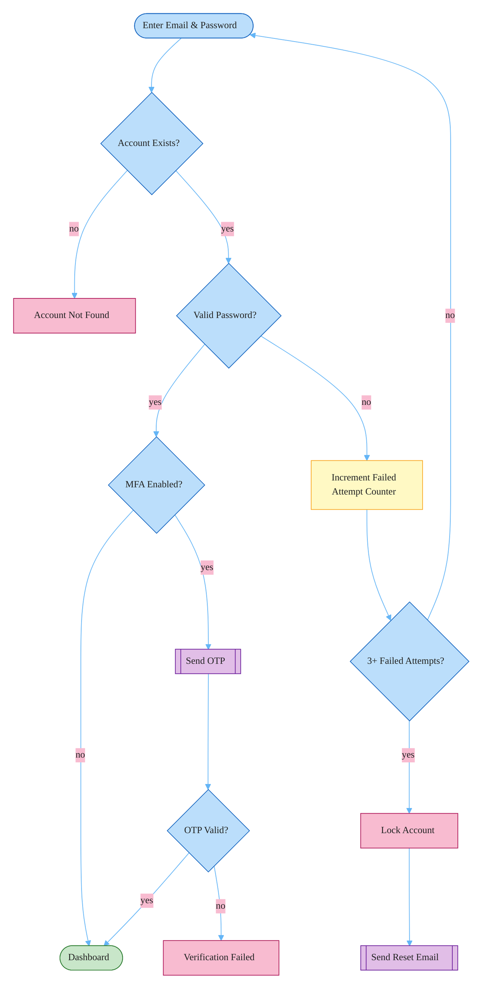

### User Authentication Flow

All fixture paths covered: account existence check, password validation with failed attempt counter (locks at 3 + sends reset email), MFA branch (OTP verification), and dashboard as final destination. External systems (email, OTP) in purple, errors in pink, caution in yellow, success in green.
