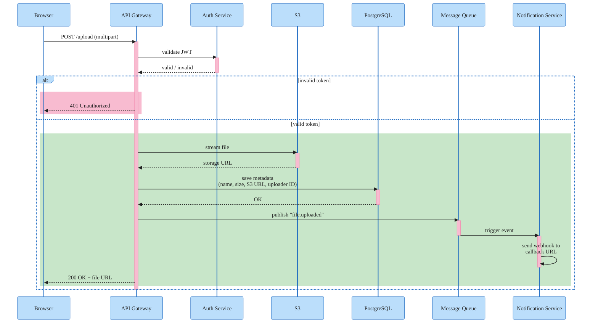

### REST API File Upload

Sequence diagram showing the full file upload flow through an API Gateway. The `alt` block splits the authentication outcome into an error path (pink) returning 401 and a success path (green) covering S3 upload, metadata persistence, event publishing, and webhook notification before returning 200 with the file URL.
