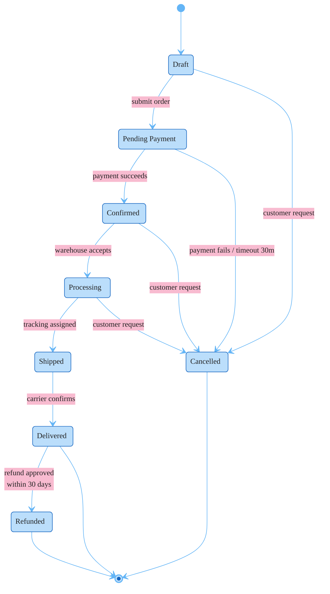

### E-Commerce Order Lifecycle

Order flows from Draft through payment, processing, and shipping to Delivered. Cancellation is possible from any state before Shipped (Draft, Pending Payment, Confirmed, Processing) via customer request, plus automatic cancellation on payment failure/timeout. Refunds available within 30 days of delivery. Terminal states: Delivered, Cancelled, Refunded.
