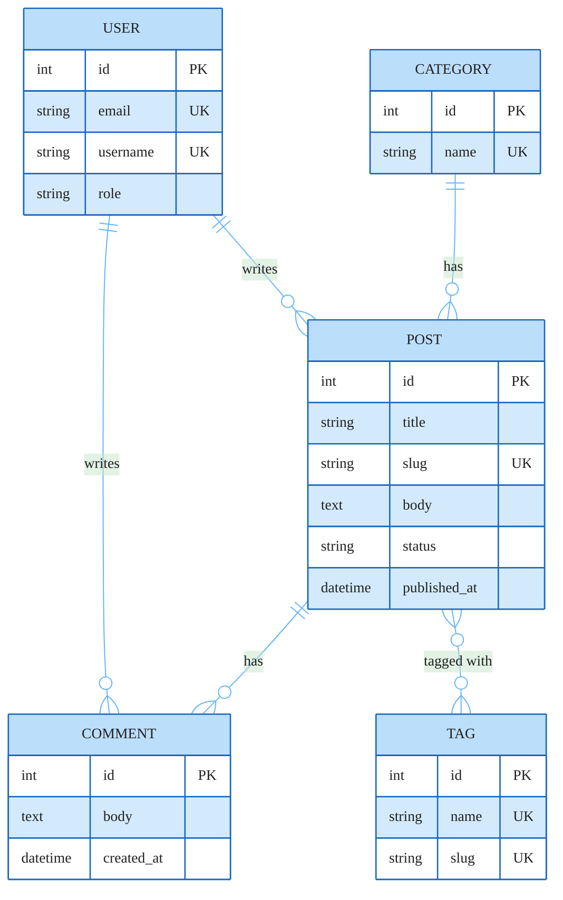

### Blog Platform Data Model

Five entities covering the core blog platform domain. The Post-Tag relationship is many-to-many (`}o--o{`), implying a join table at the physical level. All other relationships are one-to-many. PK and UK constraints shown per the fixture spec; FK columns omitted since the ER diagram lines already convey ownership.
