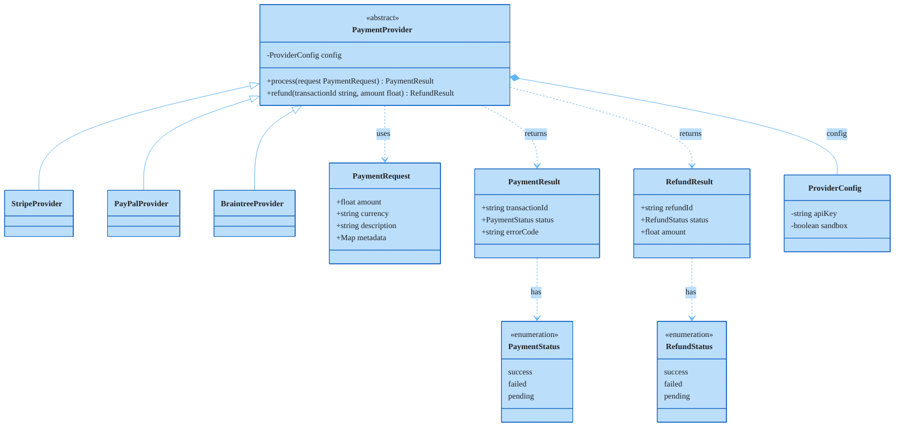

### Payment Processing Library

Abstract `PaymentProvider` sits at the top with three concrete provider implementations (Stripe, PayPal, Braintree) shown in purple as external/third-party systems. `ProviderConfig` is composed into the provider via private field. Value objects (`PaymentRequest`, `PaymentResult`, `RefundResult`) and their status enumerations are connected via dependency arrows.
