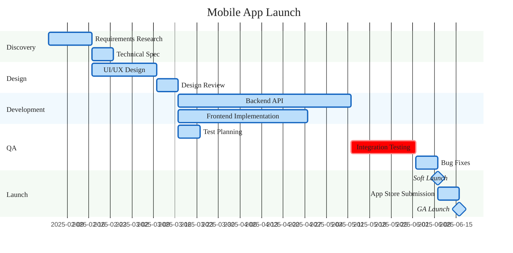

### Mobile App Launch — Gantt Chart

Five sections map to the five project phases (Discovery, Design, Development, QA, Launch). Backend API and Frontend Implementation run in parallel after Design Review. Integration Testing depends on both Backend and Frontend completion and is marked `crit`. Soft Launch and GA Launch are zero-duration milestones.
