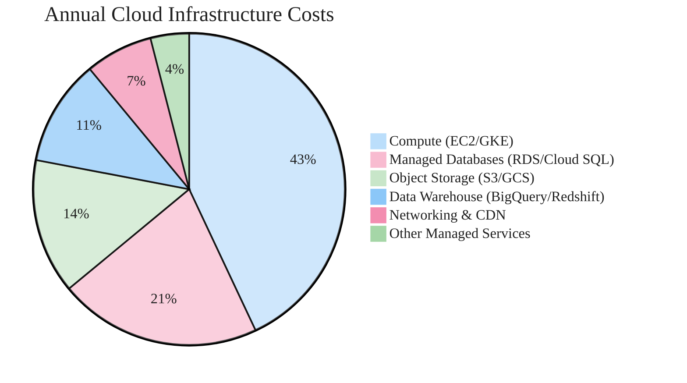

### Annual Cloud Infrastructure Cost Breakdown

Pie chart chosen — proportional distribution of cost categories. Six slices kept as-is (within the 6-8 max guideline). Values sum to 100, representing percentage share of total annual cloud spend. No custom styling applied since pie charts are styled by the theme init block.
