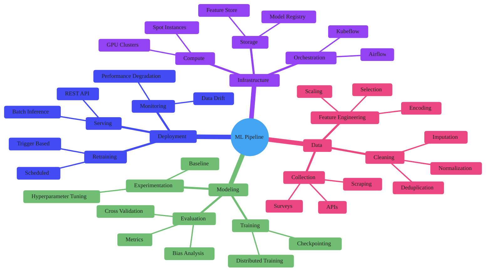

### ML Pipeline Mindmap

Four main branches cover the full ML lifecycle: Data (collection through feature engineering), Modeling (experimentation through evaluation), Deployment (serving through retraining), and Infrastructure (compute, storage, orchestration). Hierarchy is 4 levels deep. No custom styling applied — mindmap relies on the theme init block for colors.
