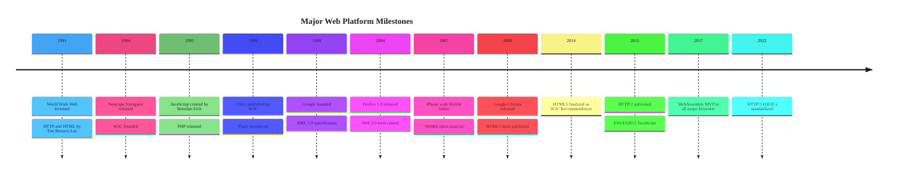

### Web Platform Milestones

Chronological timeline covering 12 milestones from 1991 to 2022. Each year lists its key events as separate entries. No custom styling applied — `timeline` relies entirely on the theme init block for colors and fonts.
