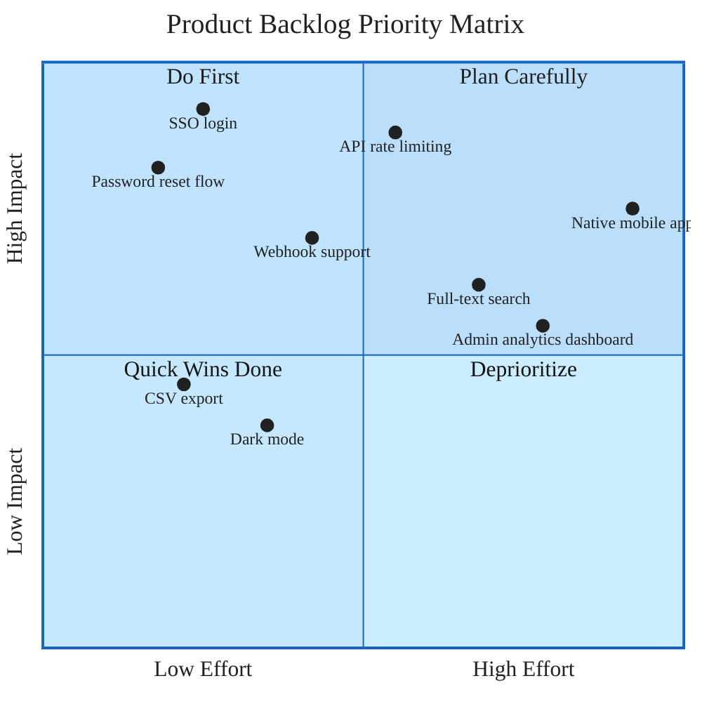

### Product Backlog Priority Matrix

Quadrant chart mapping 9 product backlog items by effort vs. impact. SSO login and Password reset flow land in "Do First" (high impact, low effort). Native mobile app and Admin analytics dashboard fall under "Plan Carefully" (high impact, high effort). No custom styling applied — quadrant charts are themed via the init block only.
