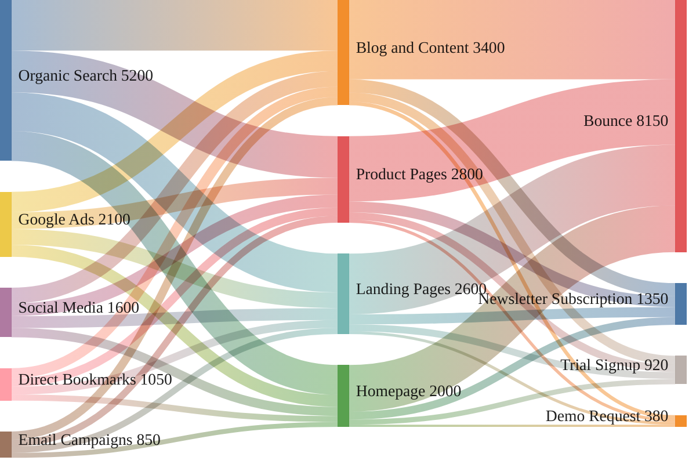

### Website Traffic Acquisition & Conversion Funnel

Three-layer Sankey showing website traffic flow: 5 acquisition sources distribute across 4 landing destination types, then flow to 4 outcomes. Total volume 10,800 visits. Bounce dominates at 8,150 (75.5%). `sankey-beta` has no `classDef` support — theme init block handles all colors.

> **Note:** `sankey-beta` requires Mermaid >= 10.3.0. Renderers on 10.2.x will show a syntax error.
