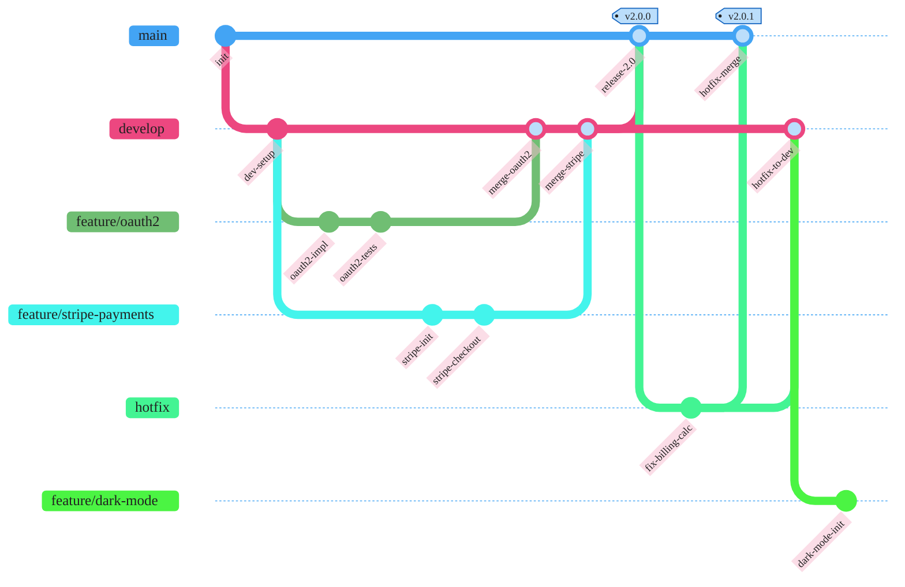

### Team Release Process — Git Workflow

Diagram type: `gitGraph` — direct match for git branching workflow.

Covers the full release process: two feature branches off develop (oauth2 merged first, then stripe-payments), release merge to main tagged v2.0.0, hotfix branch from main with billing fix merged back to both main (tagged v2.0.1) and develop, and new feature/dark-mode branch with initial commit. No semantic coloring applied — gitGraph relies entirely on the theme init block for styling.
