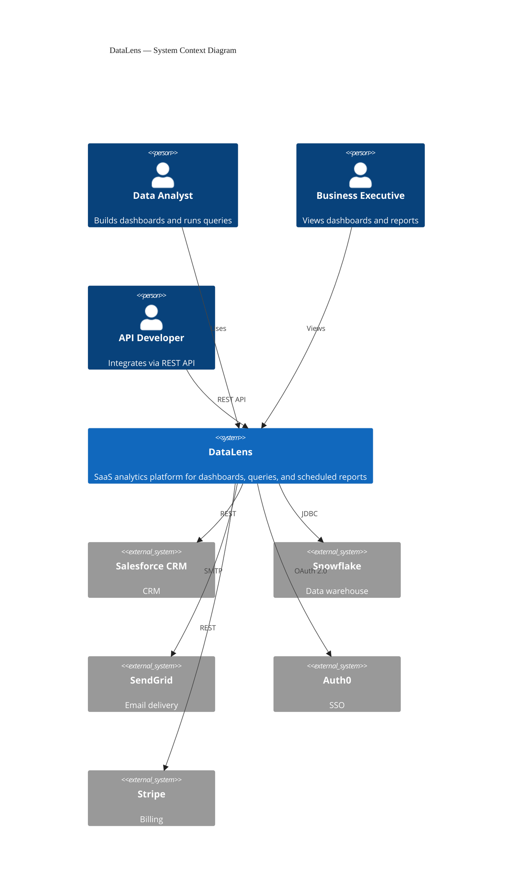

### DataLens SaaS Analytics Platform — C4 Context

Three user personas (Data Analyst, Business Executive, API Developer) interact with the central DataLens system. Five external systems: Salesforce CRM (REST), Snowflake (JDBC), SendGrid (SMTP), Auth0 (OAuth 2.0), Stripe (REST). Arrow crossings are a known C4 renderer limitation with hub-and-spoke topologies.
