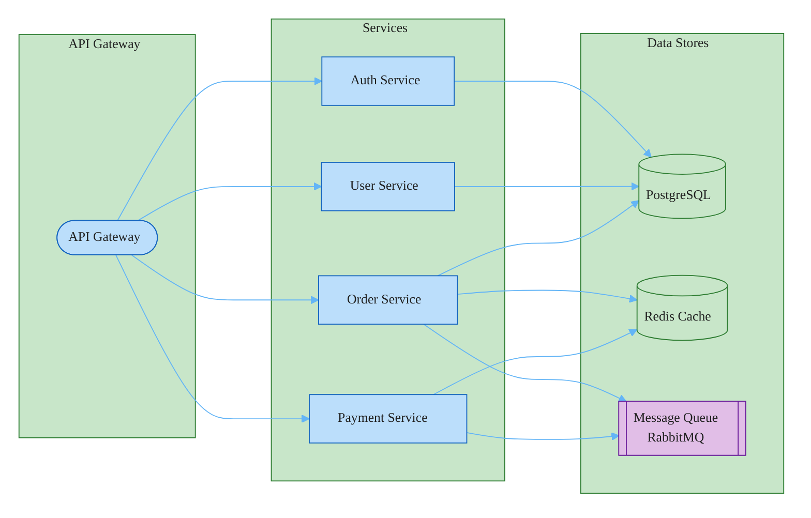

### Microservices Architecture

Uses `flowchart LR` with `subgraph` instead of `block-beta` since the fixture requires connections between nodes (block-beta arrows pass through nodes). Three subgraphs represent the columns: API Gateway on the left, four stacked services in the middle, and data stores on the right. PostgreSQL, Redis, and RabbitMQ use cylinder and subroutine shapes. Data stores colored green, message queue purple (external/async system).
