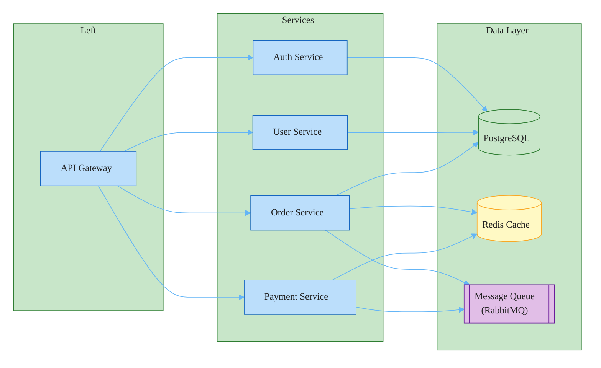

### Microservices Architecture

Uses `flowchart LR` with `subgraph` columns instead of `block-beta` — the diagram has connections between nodes, so block-beta's poor edge routing would cause arrows to pass through other nodes. Semantic colors: green for PostgreSQL (persistent storage), yellow for Redis Cache (ephemeral), purple for RabbitMQ (external broker).
