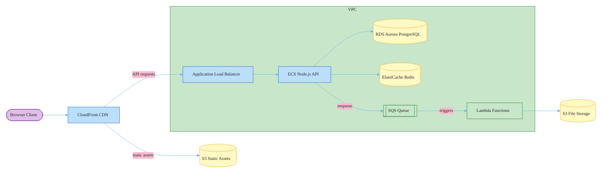

### AWS Cloud Architecture

Uses `flowchart LR` with `subgraph` for the VPC boundary instead of `architecture-beta` — the diagram has many connections and several labels with special characters (Node.js, RDS Aurora), which `architecture-beta` doesn't support. Color coding: purple = external client, yellow = storage services, green = async/messaging components.
