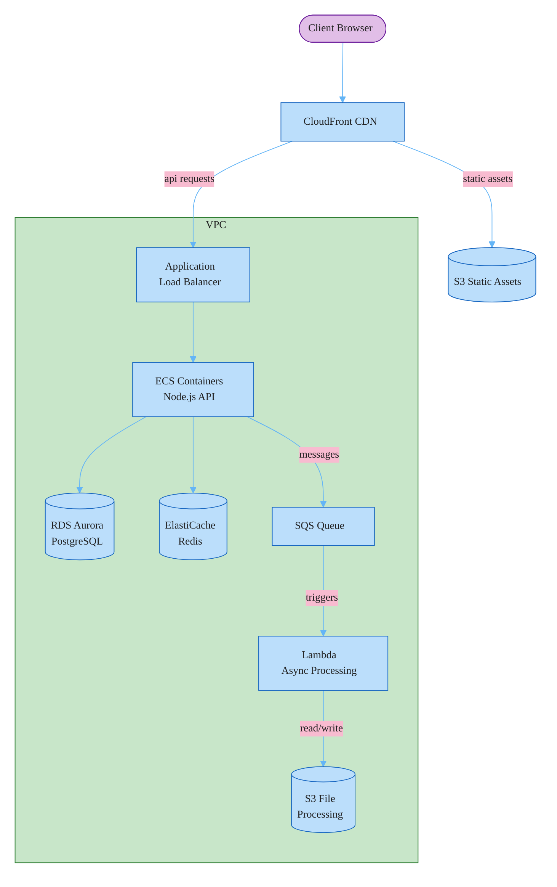

### AWS Cloud Architecture

Flowchart TD chosen over `architecture-beta` because the diagram has connected nodes with a VPC boundary -- the skill guidelines specify `flowchart` + `subgraph` for this pattern. Client browser styled as external (purple). VPC boundary groups ECS, RDS, ElastiCache, SQS, and Lambda. Storage nodes use cylinder shape. Edge labels kept short, omitted where self-evident.
