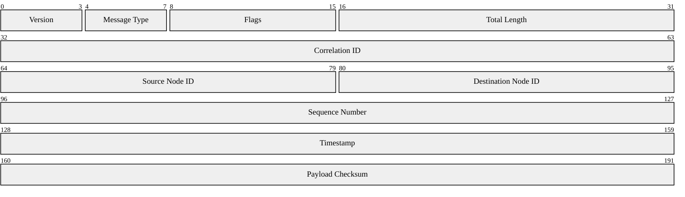

### Application Protocol Header

Binary layout of a custom application protocol header. Each row is 32 bits wide. Fields are packed contiguously starting at bit 0 through bit 191 (24 bytes total). The first row contains four fields (Version, Message Type, Flags, Total Length), while subsequent rows hold one or two fields each depending on their bit width.

> **Note:** `packet-beta` requires Mermaid >= 11.0.0. Renderers on 10.x will show a syntax error.
