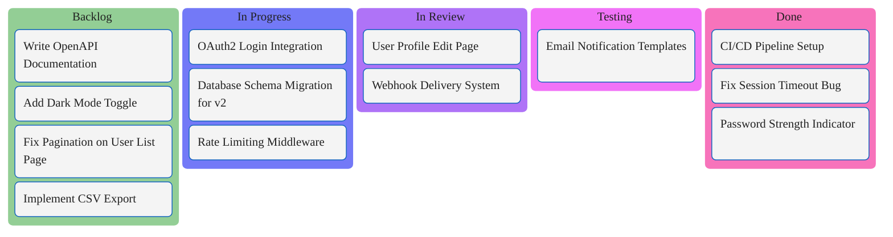

### Sprint Kanban Board

All 13 tasks placed across 5 columns matching the fixture. Kanban type chosen since the request explicitly asks for a board-style task tracker. No custom styling applied — kanban does not support `classDef`. Theme init block handles colors.

> **Note:** `kanban` requires Mermaid >= 11.4.0. Renderers on 10.x will show a syntax error.
