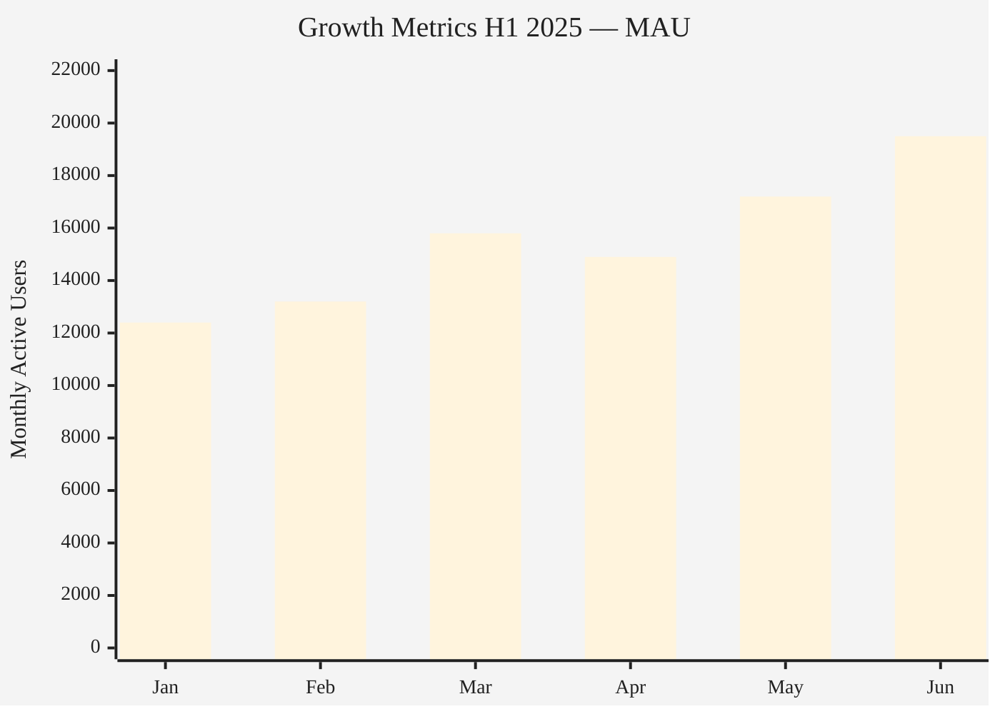
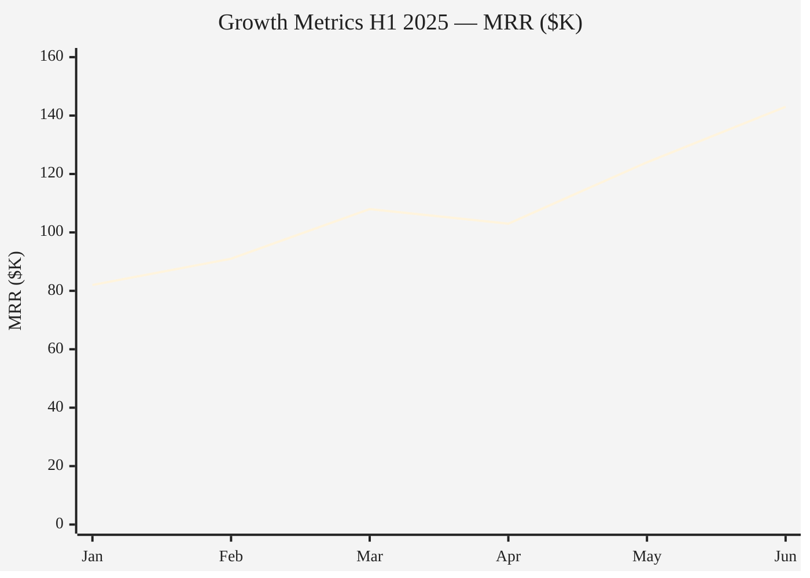

### Growth Metrics H1 2025 — Monthly Active Users

### Growth Metrics H1 2025 — Monthly Recurring Revenue

Split into two charts because `xychart-beta` supports only a single y-axis. MAU (12K-19.5K) and MRR ($82K-$143K) differ in scale by an order of magnitude — combining them on one axis would flatten the smaller series. MAU shown as bars to emphasize monthly volume, MRR as a line to highlight the revenue trend. April dip visible in both metrics.

> **Note:** `xychart-beta` requires Mermaid >= 10.5.0. Renderers on 10.2.x will show a syntax error.
