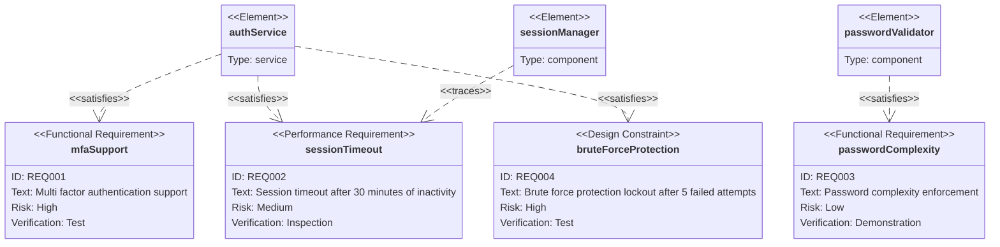

### Authentication System Requirements

Four requirements covering MFA, session management, password policy, and brute force protection. AuthService satisfies three requirements (REQ_001, REQ_002, REQ_004), SessionManager traces REQ_002 for session timeout tracking, and PasswordValidator satisfies REQ_003 for password complexity. Hyphens replaced with underscores in all identifiers per Mermaid parser constraints. No custom styling applied since `requirementDiagram` relies on the theme init block for colors.
