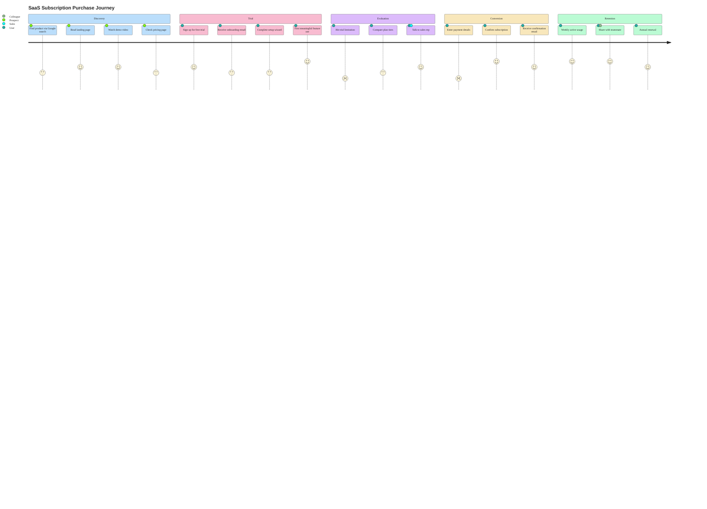

### SaaS Subscription Purchase Journey

Journey diagram mapping the full SaaS purchase lifecycle across five sections: Discovery, Trial, Evaluation, Conversion, and Retention. Satisfaction scores (1-5) reflect typical user sentiment at each step — pain points surface at trial limitations (2) and payment entry (2), while feature engagement and subscription confirmation peak at 5. Multiple actors (Prospect, User, Sales, Colleague) show handoffs across the journey.
