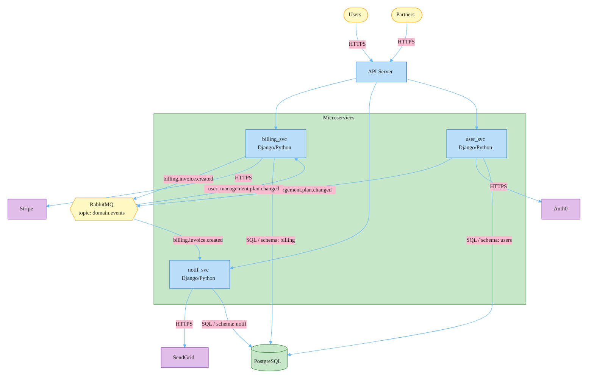

# RFC-005: Strangler Fig Extraction of Billing, Notifications, and User Management

**ID**: RFC-005
**Status**: Accepted
**Proposed by**: Engineering Team
**Created**: 2026-04-19
**Last Updated**: 2026-04-19
**Targets**: Implementation, C4, ADR

## Problem / Motivation

The Django monolith's three bounded contexts communicate via synchronous in-process function calls. Two coupling points cause direct operational problems:

1. `billing` calls `notifications.send_receipt()` synchronously after invoice creation. A slow or unavailable email provider (SendGrid latency spike, rate limit) blocks the billing response path and can cause the entire transaction to roll back — the invoice record fails to persist if the notification call raises.
2. `user_management` calls `billing.recalculate_plan()` on every plan change. Billing latency (Stripe API calls, subscription recalculation) directly degrades the user management response time.

Neither context can be deployed independently — a migration in notifications requires coordinating a billing deploy, and vice versa. Neither can be scaled independently; a billing traffic spike cannot be absorbed by scaling billing alone without scaling the entire monolith.

ADR-002 approved RabbitMQ with Celery as the target messaging solution. The C4 container diagram already reflects the target state. This RFC defines the implementation approach to reach that state with zero customer-visible downtime.

## Goals and Non-Goals

### Goals

- Replace both synchronous coupling points with RabbitMQ domain events per ADR-002
- Extract notifications, billing, and user management into independently deployable and scalable Django services
- Complete extraction with no customer-visible downtime — strangler fig with dual-write validation before each cut-over
- Establish transactional outbox and idempotent consumer as standard patterns for all event-driven services in this platform
- Validate each service extraction independently before committing to cut-over

### Non-Goals

- Revisiting the message broker or client library choice — decided in ADR-002 (RabbitMQ, Celery)
- Adding product features to any extracted service during migration
- Migrating other monolith bounded contexts beyond these three
- Splitting the shared PostgreSQL instance — each service retains its existing schema slice in the shared DB
- Changing any customer-facing API shapes or contracts

## Proposed Solution

Sequential strangler fig extraction using a migration adapter pattern. Each service is extracted independently, in order of coupling complexity: notifications first (pure consumer, no outbound dependencies on the other two), then billing, then user management.

### Architecture: Before

```mermaid
%%{init: {'theme': 'base', 'flowchart': {'nodeSpacing': 60, 'rankSpacing': 80, 'diagramPadding': 20}, 'themeVariables': {'primaryColor': '#BBDEFB', 'primaryTextColor': '#212121', 'primaryBorderColor': '#1565C0', 'lineColor': '#64B5F6', 'secondaryColor': '#F8BBD0', 'secondaryTextColor': '#212121', 'secondaryBorderColor': '#AD1457', 'tertiaryColor': '#C8E6C9', 'tertiaryTextColor': '#212121', 'tertiaryBorderColor': '#2E7D32', 'noteBkgColor': '#FFF9C4', 'noteTextColor': '#212121', 'noteBorderColor': '#F9A825', 'fontFamily': 'Inter, Roboto, sans-serif', 'fontSize': '14px'}}}%%
flowchart TD
    classDef ext fill:#E1BEE7,stroke:#6A1B9A,color:#212121
    classDef db fill:#C8E6C9,stroke:#2E7D32,color:#212121
    classDef actor fill:#FFF9C4,stroke:#F9A825,color:#212121

    users([Users]):::actor
    partners([Partners]):::actor

    subgraph monolith ["Django Monolith"]
        billing[billing module]
        notif[notifications module]
        user_mgmt[user_management module]
        billing -->|send_receipt() sync| notif
        user_mgmt -->|recalculate_plan() sync| billing
    end

    users -->|HTTPS| monolith
    partners -->|HTTPS| monolith

    monolith -->|SQL| pg[(PostgreSQL)]:::db
    monolith -->|HTTPS| stripe[Stripe]:::ext
    monolith -->|HTTPS| sendgrid[SendGrid]:::ext
    monolith -->|HTTPS| auth0[Auth0]:::ext
```

### Architecture: After



### Migration Phases (per service)

```mermaid
%%{init: {'theme': 'base', 'flowchart': {'nodeSpacing': 60, 'rankSpacing': 80, 'diagramPadding': 20}, 'themeVariables': {'primaryColor': '#BBDEFB', 'primaryTextColor': '#212121', 'primaryBorderColor': '#1565C0', 'lineColor': '#64B5F6', 'secondaryColor': '#F8BBD0', 'secondaryTextColor': '#212121', 'secondaryBorderColor': '#AD1457', 'tertiaryColor': '#C8E6C9', 'tertiaryTextColor': '#212121', 'tertiaryBorderColor': '#2E7D32', 'noteBkgColor': '#FFF9C4', 'noteTextColor': '#212121', 'noteBorderColor': '#F9A825', 'fontFamily': 'Inter, Roboto, sans-serif', 'fontSize': '14px'}}}%%
flowchart TD
    classDef ok fill:#C8E6C9,stroke:#2E7D32,color:#212121
    classDef warn fill:#FFF9C4,stroke:#F9A825,color:#212121
    classDef done fill:#F5F5F5,stroke:#616161,color:#212121
    classDef active fill:#BBDEFB,stroke:#1565C0,color:#212121

    p1_start(["Phase 1: Deploy"]):::active
    p1a["Deploy notif_svc<br/>No traffic routed"]
    p1b["dispatch_mode = sync<br/>(unchanged)"]:::done

    p2_start(["Phase 2: Dual-Write"]):::warn
    p2a["Monolith calls send_receipt()<br/>AND publishes billing.invoice.created"]
    p2b["notif_svc consumes event<br/>Shadow mode — outputs<br/>compared in logs"]
    p2c["dispatch_mode = dual"]:::warn

    p3_start(["Phase 3: Cut-Over"]):::ok
    p3a["Monolith publishes event only<br/>sync call removed from hot path"]
    p3b["notif_svc is authoritative"]:::ok
    p3c["dispatch_mode = event"]:::ok

    p4_start(["Phase 4: Cleanup"]):::done
    p4a["Remove send_receipt() call<br/>from monolith codebase"]:::done
    p4b["Monolith has zero knowledge<br/>of notifications"]:::done

    p1_start --> p1a
    p1a --> p1b
    p1b -->|"deploy notif_svc"| p2_start
    p2_start --> p2a
    p2a --> p2b
    p2b --> p2c
    p2c -->|"shadow outputs match"| p3_start
    p3_start --> p3a
    p3a --> p3b
    p3b --> p3c
    p3c -->|"stable in prod"| p4_start
    p4_start --> p4a
    p4a --> p4b
```



### Core Patterns

#### Transactional Outbox

Events are written to an `OutboxEntry` table in the same database transaction as the business state change. A Celery beat relay task (running every 5 seconds) drains unpublished entries to RabbitMQ. This guarantees at-least-once delivery with no silent event loss on process crash — the outbox row survives crashes; the relay task picks it up on the next beat cycle.

`OutboxEntry` fields: `id` (UUID PK), `event_type`, `exchange`, `routing_key`, `payload` (JSON envelope), `created_at`, `published_at` (null until delivered), `failed_at`, `attempt_count`. The relay uses `SELECT FOR UPDATE SKIP LOCKED` to allow multiple relay workers without double-processing.

Direct publishing to RabbitMQ inside the transaction is not used because a commit followed by a network failure before the AMQP publish permanently loses the event. The outbox row acts as the durable record.

#### Migration Adapter

Each coupling point in the monolith is wrapped in a dispatcher implementing a typed Protocol:

```
NotificationDispatcher.send_receipt(invoice_id, user_id)
PlanRecalculationAdapter.recalculate(user_id, old_plan, new_plan)
```

Three implementations exist per coupling point:

- `SynchronousDispatcher` — direct import and function call (current behavior)
- `EventBasedDispatcher` — publishes domain event via `OutboxPublisher`
- `DualWriteDispatcher` — calls sync first, then publishes event; event-path errors are logged but never propagate (sync call is authoritative during this phase)

The active implementation is controlled by a Django settings flag (`NOTIFICATION_DISPATCH_MODE` / `PLAN_RECALC_DISPATCH_MODE`) with values `"sync"`, `"dual"`, or `"event"`. No call sites in the service layer change — only the composition root reads the flag.

#### Idempotent Consumers

Each consumer service maintains a `ProcessedEvent` table with `event_id` (UUID PK) and `processed_at`. Before executing any handler, the consumer attempts to insert a `ProcessedEvent` row inside a transaction. An `IntegrityError` (duplicate PK) means the event was already processed — the handler is skipped silently. This is required because RabbitMQ delivers at-least-once and Celery with `acks_late=True` can redeliver on worker crashes.

#### Event Envelope

All events share a common wire format:

```
event_id, event_type (e.g. "billing.invoice.created"),
aggregate_id, aggregate_type, service_origin,
occurred_at (UTC), schema_version, correlation_id,
payload (dict — event-specific)
```

Pydantic validates the envelope at the consumer boundary only. Internal domain events are frozen Python dataclasses. The two are explicitly different types — domain events are never sent over the wire directly.

#### Module Structure (per extracted service)

```
{service}/
  domain/        — frozen dataclasses: entities, domain events, ports (Protocols)
  application/   — orchestration: service classes, commands
  adapters/      — ORM models, external API clients
  events/
    outbox.py       — OutboxEntry ORM model
    publishers.py   — OutboxPublisher implements EventPublisher Protocol
    relay.py        — Celery beat task (drains outbox to RabbitMQ)
    consumers.py    — Celery tasks (inbound events)
    handlers.py     — pure handler functions (no Celery coupling)
    idempotency.py  — ProcessedEvent ORM model
    schemas.py      — Pydantic wire models for this service's events
  celery.py      — Celery app with explicit queue declarations + DLQ config
```

Each service has its own Celery app with isolated queues, routing, and beat schedules. Queue declarations include `x-dead-letter-exchange` and `x-message-ttl`. Auto-created queues are not used — implicit queue creation in production has caused silent message loss on unexpected restarts.

### Extraction Order and Sequence

**Service 1: Notifications** (pure consumer from billing's perspective)
- Billing publishes `billing.invoice.created` event
- `notif_svc` consumes it and calls SendGrid
- Monolith's `NOTIFICATION_DISPATCH_MODE` transitions: `sync` → `dual` → `event`
- Validation criterion: 5 consecutive business days at <0.1% divergence between sync and event paths; tech lead sign-off required before switching to `"event"`

**Service 2: Billing** (both publisher and consumer)
- Billing publishes `billing.invoice.created` (established in Service 1)
- Billing consumes `user_management.plan.changed` (new)
- Requires `OutboxPublisher` + relay already proven from Service 1
- Monolith's `PLAN_RECALC_DISPATCH_MODE`: `sync` → `dual` → `event`
- Stripe integration and all internal billing logic move with the service unchanged

**Service 3: User Management** (publisher of plan.changed)
- User management publishes `user_management.plan.changed`
- Most complex extraction: Auth0 integration, team management, plan assignment
- By this point the event infrastructure (outbox, relay, consumer patterns) is proven across two services

### Shared Event Schema Package

`shared_events/` — a monorepo module at the repo root containing `EventEnvelope` (Pydantic model) and per-event payload schemas (`InvoiceCreatedPayload`, `PlanChangedPayload`). All three service apps import it as a local package. Schema changes follow expand-contract: new optional fields only in minor bumps; `schema_version` bumped for incompatible changes with old consumer handler retained until all consumers are updated.

## Alternatives

### Events-First In-Process Refactor

Refactor the monolith to use an in-process publisher interface (backed by synchronous in-process delivery) before introducing RabbitMQ or extracting any service. Once all cross-module calls go through publisher interfaces, swap the publisher to the outbox + RabbitMQ implementation. Extract services to separate processes in a third phase.

**Rejected**: Introduces two migration phases instead of one per service. The intermediate state — RabbitMQ-connected but consumers running in the same process — is the hardest phase to validate: events and their consumers share a process boundary, making it difficult to observe whether the consumer is behaving independently or benefiting from shared state. This approach also defers the deployment isolation benefit (services can't deploy independently) to the third phase, meaning the monolith coupling continues to block independent deploys longer than the strangler fig approach.

### Parallel Deploy of All Three Services

Deploy all three extracted services simultaneously alongside the monolith. Switch all three coupling points to `"dual"` mode on the same date. Validate all three concurrently. Cut over all three together.

**Rejected**: The blast radius of a defect during dual-write is three times larger — a bug in the `user_management.plan.changed` consumer and a bug in `billing.invoice.created` consumer manifest simultaneously, making incident isolation harder. More critically, the three services have different extraction complexity: notifications is straightforward (pure consumer, no upstream coupling), billing requires outbox relay proven to work, and user management is the most structurally complex. Forcing a uniform timeline introduces coupling into the migration itself — a delay in user management extraction blocks the notifications cut-over unnecessarily. Sequential extraction lets each service benefit from lessons learned in the previous one.

## Impact

- **Files / Modules**:
  - `shared_events/` — new monorepo module: `EventEnvelope`, `InvoiceCreatedPayload`, `PlanChangedPayload`
  - `billing/events/` — new: `outbox.py`, `publishers.py`, `relay.py`, `schemas.py`
  - `billing/adapters/notification_adapter.py` — new during migration, deleted post-cut-over
  - `notifications/events/` — new: `consumers.py`, `handlers.py`, `idempotency.py`, `schemas.py`
  - `user_management/events/` — new: `outbox.py`, `publishers.py`, `relay.py`, `consumers.py`, `handlers.py`, `idempotency.py`, `schemas.py`
  - `user_management/adapters/billing_adapter.py` — new during migration, deleted post-cut-over
  - `{service}/celery.py` — new Celery app per extracted service with explicit queue declarations
- **C4**: Container diagram already reflects target state (three separate Django services + RabbitMQ broker per ADR-002). No new containers added by this RFC. Notes section should be updated to reference this RFC.
- **ADRs**: Amend ADR-002 to record the transactional outbox as the delivery implementation (ADR-002 approved RabbitMQ but did not specify direct publish vs outbox relay) and the idempotent consumer pattern as mandatory for all consumers.
- **Breaking changes**: No. All customer-facing API contracts are unchanged. The migration is entirely internal to inter-module communication.

## Open Questions

- [x] Dual-write validation SLA: what divergence threshold and who approves cut-over sign-off? → **<0.1% event divergence over 5 consecutive business days; tech lead sign-off required before switching dispatch_mode to "event"**
- [x] `shared_events` package distribution: shared internal PyPI package, copied per-service, or monorepo shared module? → **Monorepo shared module at `shared_events/` in the repo root; imported by all three service apps as a local package**
- [x] DLQ alerting: Datadog alert on DLQ depth > 0 required before any service cut-over? → **Yes — Datadog alert on DLQ depth > 0 must be active and verified before any service cut-over is approved**
- [x] Relay beat interval: is 5-second default acceptable latency for receipt emails? → **5-second default accepted; no receipt email delivery SLA is currently specified; revisit if a sub-5s SLA is defined**

---

## Change Log

- 2026-04-19: Initial draft
- 2026-04-19: Status → In Review; resolved all open questions (validation SLA, shared_events as monorepo module, DLQ alerting, relay beat interval)
