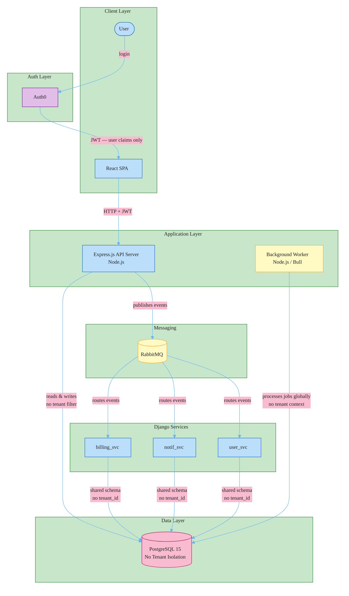
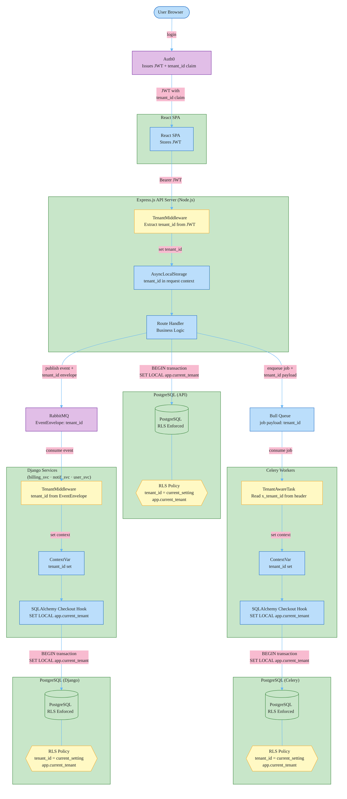

# RFC-004: Multi-Tenancy Foundation — Data Model, RLS, Auth, and Context Propagation

**ID**: RFC-004
**Status**: Accepted
**Proposed by**: Engineering Team
**Created**: 2026-04-19
**Last Updated**: 2026-04-19
**Targets**: Implementation, C4, ADR

## Problem / Motivation

The platform is executing a B2B pivot to onboard enterprise customers, each requiring isolated environments. The current state makes this unsafe to ship:

- All data lives in a shared PostgreSQL schema with no `tenant_id` column. A single bug in any query exposes one customer's data to another.
- Auth0 issues JWTs with only user-level claims (`sub`, `email`). There is no tenant identity in the token.
- The API Server has no concept of tenant context — no middleware extracts or enforces tenant boundaries.
- Django services (billing_svc, notif_svc, user_svc) read and write shared tables without any tenant filtering.
- Celery workers and Bull workers process jobs without tenant context — job queues are global across all customers.
- RabbitMQ events carry no tenant identity — consumers cannot scope event handling to a single tenant.

Without this foundation every subsequent multi-tenancy feature (per-tenant config, billing, admin portal) builds on an unsafe base. This RFC establishes the data model, database enforcement, auth integration, and context propagation that all subsequent multi-tenancy work depends on.

## Goals and Non-Goals

### Goals

- Establish a `tenants` table as the single source of truth for tenant identity, linked to Auth0 Organizations via `auth0_org_id`
- Add `tenant_id` FK to all tenant-scoped tables in billing_svc, notif_svc, and user_svc schemas; migrate existing rows to a provisioned default tenant
- Enable PostgreSQL Row-Level Security on all tenant-scoped tables with policy `USING (tenant_id = NULLIF(current_setting('app.current_tenant', TRUE), '')::uuid)`
- Integrate Auth0 Organizations: tenant_id injected as a custom claim in every JWT issued to tenant members
- Add TenantMiddleware to Express.js API Server: extract tenant claim, set AsyncLocalStorage, 403 for missing/invalid tenant context on protected routes
- Add TenantMiddleware to all Django services: extract tenant_id from request or EventEnvelope, set ContextVar
- Add SQLAlchemy `checkout` event hook on all service engines: `set_config('app.current_tenant', <uuid>, TRUE)` per transaction — PgBouncer transaction-mode compatible
- Add `TenantAwareTask` Celery base task class: inject `x_tenant_id` into task headers at `apply_async` time; restore ContextVar at execution time
- Add `tenant_id: uuid.UUID` field to `EventEnvelope` in shared_events; publisher reads from ContextVar
- Provision a dedicated `app_admin` PostgreSQL role with `BYPASSRLS` for migration runners and internal admin operations

### Non-Goals

- Per-tenant configuration and feature flags (RFC-005)
- Tenant-scoped Bull job queue naming convention (RFC-005)
- Per-tenant billing, Stripe Customer objects, and usage metering (RFC-005)
- Tenant admin self-service portal (RFC-006)
- Tenant context for the 6 services not listed in the current C4 — deferred until C4 is updated to reflect full service inventory
- Enterprise SSO/SCIM provisioning beyond Auth0 Organization membership
- Multi-region data residency or per-tenant data export tooling
- Tenant deletion and offboarding workflow

## Proposed Solution

### Architecture: Before



### Architecture: After



### 1. Tenant Data Model

A `shared` schema in PostgreSQL holds the `tenants` table, accessible by all services. A `shared/tenancy/` Python package is added to the monorepo and imported by all Django services.

**Package structure:**

```
shared/
  tenancy/
    __init__.py          # exports: tenant_context, TenantId, TenantMiddleware
    models.py            # Tenant ORM model, TenantPlan, TenantStatus enums
    context.py           # ContextVar, tenant_context(), admin_context()
    middleware.py        # Django TenantMiddleware (reads JWT claim)
    hooks.py             # SQLAlchemy register_tenant_hooks(engine)
    celery_integration.py # TenantAwareTask base class
```

**SQLAlchemy 2.0 ORM model (SQLAlchemy `Mapped` style, consistent with existing service models):**

```python
# shared/tenancy/models.py
import uuid
from datetime import datetime
from enum import StrEnum
from sqlalchemy import String, DateTime, func
from sqlalchemy.dialects.postgresql import UUID
from sqlalchemy.orm import DeclarativeBase, Mapped, mapped_column
from typing import NewType

TenantId = NewType("TenantId", uuid.UUID)

class TenantPlan(StrEnum):
    STARTER = "starter"
    BUSINESS = "business"
    ENTERPRISE = "enterprise"

class TenantStatus(StrEnum):
    ACTIVE = "active"
    SUSPENDED = "suspended"
    CANCELLED = "cancelled"

class Tenant(Base):
    __tablename__ = "tenants"
    __table_args__ = {"schema": "shared"}

    id: Mapped[uuid.UUID] = mapped_column(UUID(as_uuid=True), primary_key=True, default=uuid.uuid4)
    slug: Mapped[str] = mapped_column(String(63), unique=True, nullable=False)
    name: Mapped[str] = mapped_column(String(255), nullable=False)
    plan: Mapped[TenantPlan] = mapped_column(String(20), nullable=False, default=TenantPlan.STARTER)
    status: Mapped[TenantStatus] = mapped_column(String(20), nullable=False, default=TenantStatus.ACTIVE)
    auth0_org_id: Mapped[str | None] = mapped_column(String(64), unique=True, nullable=True)
    created_at: Mapped[datetime] = mapped_column(DateTime(timezone=True), server_default=func.now())
```

**Tenant-scoped tables requiring `tenant_id` FK:**

- `user_svc.users`, `user_svc.projects`, `user_svc.teams`
- `billing_svc.billing_subscriptions`, `billing_svc.invoices`
- `notif_svc.notification_logs`, `notif_svc.notification_templates`

**Tenant-agnostic tables (no RLS, no `tenant_id`):**

- `shared.tenants` itself — cross-tenant by definition
- Plan tier lookup tables, channel type enums — no per-row tenant ownership

### 2. Database Migration Strategy

Each service runs its own Alembic migration. The pattern is identical across all three services:

```python
# migrations/versions/0002_add_tenant_id.py  (billing_svc example)
def upgrade() -> None:
    # Step 1: provision default tenant for existing single-tenant data
    op.execute(sa.text("""
        INSERT INTO shared.tenants (id, slug, name, plan, status, created_at)
        VALUES ('00000000-0000-0000-0000-000000000001', 'default', 'Default Tenant',
                'enterprise', 'active', now())
        ON CONFLICT DO NOTHING
    """))

    # Step 2: add nullable column
    op.add_column("billing_subscriptions",
        sa.Column("tenant_id", UUID(as_uuid=True), nullable=True),
        schema="billing_svc")

    # Step 3: backfill existing rows to default tenant
    op.execute(sa.text("""
        UPDATE billing_svc.billing_subscriptions
        SET tenant_id = '00000000-0000-0000-0000-000000000001'
        WHERE tenant_id IS NULL
    """))

    # Step 4: tighten to NOT NULL
    op.alter_column("billing_subscriptions", "tenant_id", nullable=False, schema="billing_svc")

    # Step 5: FK + index
    op.create_foreign_key("fk_billing_subscriptions_tenant_id",
        "billing_subscriptions", "tenants", ["tenant_id"], ["id"],
        source_schema="billing_svc", referent_schema="shared")
    op.create_index("ix_billing_subscriptions_tenant_id",
        "billing_subscriptions", ["tenant_id"], schema="billing_svc")

    # Step 6: enable RLS (see section 3)
    op.execute(sa.text("ALTER TABLE billing_svc.billing_subscriptions ENABLE ROW LEVEL SECURITY"))
    op.execute(sa.text("ALTER TABLE billing_svc.billing_subscriptions FORCE ROW LEVEL SECURITY"))
    op.execute(sa.text("""
        CREATE POLICY tenant_isolation ON billing_svc.billing_subscriptions
        USING (NULLIF(current_setting('app.current_tenant', TRUE), '')::uuid = tenant_id)
    """))
```

The migration runner connects as `app_admin` (BYPASSRLS role) so it can write rows before RLS is enabled.

### 3. PostgreSQL Row-Level Security

RLS policy per tenant-scoped table:

```sql
ALTER TABLE {schema}.{table} ENABLE ROW LEVEL SECURITY;
ALTER TABLE {schema}.{table} FORCE ROW LEVEL SECURITY;  -- applies to table owner too

CREATE POLICY tenant_isolation ON {schema}.{table}
    USING (NULLIF(current_setting('app.current_tenant', TRUE), '')::uuid = tenant_id);
```

The `NULLIF(..., '')` converts an empty string (set during `admin_context()`) to NULL, so `NULL = tenant_id` evaluates to false — zero rows returned, no error. Without this, an empty string cast to UUID raises a cast exception and crashes the request.

**DB roles:**

```sql
CREATE ROLE app_user;           -- application service connections; RLS enforced
CREATE ROLE app_admin BYPASSRLS; -- migration runner, admin CLI; RLS bypassed
```

The application connection string uses `app_user`. Alembic's `sqlalchemy.url` uses `app_admin`. Admin CLI scripts use `app_admin`. No application code path uses `app_admin`.

### 4. Tenant Context in Python (ContextVar + SQLAlchemy Hook)

```python
# shared/tenancy/context.py
from contextvars import ContextVar
from contextlib import contextmanager
import uuid

_current_tenant_id: ContextVar[uuid.UUID | None] = ContextVar("current_tenant_id", default=None)

@contextmanager
def tenant_context(tenant_id: uuid.UUID):
    token = _current_tenant_id.set(tenant_id)
    try:
        yield
    finally:
        _current_tenant_id.reset(token)

@contextmanager
def admin_context():
    """Explicitly bypass tenant filter. Sets empty string → RLS returns zero rows."""
    token = _current_tenant_id.set(None)
    try:
        yield
    finally:
        _current_tenant_id.reset(token)
```

`ContextVar` is used instead of `threading.local` because it is safe in both threaded WSGI and async ASGI deployments. Each coroutine or thread gets an isolated copy; there is no risk of a context from one async task leaking into another.

```python
# shared/tenancy/hooks.py
from sqlalchemy import Engine, event
from .context import _current_tenant_id

def register_tenant_hooks(engine: Engine) -> None:
    @event.listens_for(engine, "checkout")
    def _set_tenant(dbapi_conn, conn_record, conn_proxy):
        tenant_id = _current_tenant_id.get()
        cursor = dbapi_conn.cursor()
        cursor.execute(
            "SELECT set_config('app.current_tenant', %s, TRUE)",
            (str(tenant_id) if tenant_id is not None else "",)
        )
        cursor.close()
```

`set_config(..., TRUE)` is equivalent to `SET LOCAL` — it resets at transaction end. This is PgBouncer transaction-mode compatible: the setting never persists across transaction boundaries, so a connection returned to the pool by tenant A cannot carry tenant A's context when checked out by tenant B.

`checkout` fires every time a connection is checked out from the pool — the correct hook. `connect` fires only on pool initialization (wrong). `before_cursor_execute` fires on every statement (too heavy).

**Django TenantMiddleware:**

```python
# shared/tenancy/middleware.py
TENANT_CLAIM = "https://yourapp.com/tenant_id"

class TenantMiddleware:
    def __init__(self, get_response):
        self._get_response = get_response

    def __call__(self, request):
        tenant_id = self._extract(request)
        if tenant_id is None:
            return self._get_response(request)
        with tenant_context(tenant_id):
            return self._get_response(request)

    def _extract(self, request):
        auth = getattr(request, "auth", None)
        if not auth:
            return None
        raw = auth.get(TENANT_CLAIM)
        if not raw:
            return None
        try:
            return uuid.UUID(raw)
        except (ValueError, AttributeError):
            return None
```

Middleware order: `JWTAuthMiddleware` (validates token, sets `request.auth`) must run before `TenantMiddleware`.

**Engine wiring (one call per service at startup):**

```python
# billing_svc/db.py
from sqlalchemy import create_engine
from shared.tenancy.hooks import register_tenant_hooks

engine = create_engine(settings.DATABASE_URL)
register_tenant_hooks(engine)
```

### 5. Celery: TenantAwareTask

```python
# shared/tenancy/celery_integration.py
from celery import Task
from .context import _current_tenant_id
import uuid

class TenantAwareTask(Task):
    def apply_async(self, args=None, kwargs=None, **options):
        tenant_id = _current_tenant_id.get()
        headers = options.setdefault("headers", {})
        if tenant_id is not None:
            headers["x_tenant_id"] = str(tenant_id)
        return super().apply_async(args, kwargs, **options)

    def __call__(self, *args, **kwargs):
        raw = self.request.get("x_tenant_id")
        if raw:
            token = _current_tenant_id.set(uuid.UUID(raw))
            try:
                return super().__call__(*args, **kwargs)
            finally:
                _current_tenant_id.reset(token)
        return super().__call__(*args, **kwargs)
```

Registered as default base task in each service's `celery.py`:

```python
app = Celery("billing_svc")
app.Task = TenantAwareTask
```

### 6. EventEnvelope Extension

```python
# shared_events/envelope.py
@dataclass(frozen=True, slots=True)
class EventEnvelope:
    event_type: str
    payload: dict[str, Any]
    tenant_id: uuid.UUID          # new field — required
    event_id: uuid.UUID = field(default_factory=uuid.uuid4)
    occurred_at: datetime = field(default_factory=datetime.utcnow)
    correlation_id: uuid.UUID | None = None
```

Publishers must be called inside a `tenant_context`. `build_envelope()` reads from the ContextVar and raises `RuntimeError` if called outside tenant context — this catches programming errors at development time rather than silently publishing tenant-less events.

### 7. Node.js API Server: Tenant Middleware

The Express.js API Server uses AsyncLocalStorage for request-scoped tenant context and pg (node-postgres) for database access.

```typescript
// src/middleware/tenant.ts
import { AsyncLocalStorage } from 'async_hooks';

export const tenantStorage = new AsyncLocalStorage<{ tenantId: string }>();

const TENANT_CLAIM = 'https://yourapp.com/tenant_id';

export function tenantMiddleware(req, res, next) {
  const tenantId = req.auth?.[TENANT_CLAIM];
  if (!tenantId) {
    return res.status(403).json({ error: 'Missing tenant context' });
  }
  tenantStorage.run({ tenantId }, next);
}
```

```typescript
// src/db/tenant-client.ts  — wrapper for all DB operations in API server
import { pool } from './pool';
import { tenantStorage } from '../middleware/tenant';

export async function withTenantConnection<T>(
  callback: (client: PoolClient) => Promise<T>
): Promise<T> {
  const store = tenantStorage.getStore();
  const client = await pool.connect();
  try {
    await client.query(
      "SELECT set_config('app.current_tenant', $1, TRUE)",
      [store?.tenantId ?? '']
    );
    return await callback(client);
  } finally {
    client.release();
  }
}
```

All database operations in route handlers use `withTenantConnection`. Direct `pool.query()` calls are disallowed by a lint rule (`no-restricted-syntax` on `pool.query`).

### 8. Auth0 Organizations Integration

Auth0 Organizations maps an organization (enterprise tenant) to a set of members. An Auth0 Action (post-login trigger) injects `tenant_id` as a custom claim:

```javascript
// Auth0 Action: inject-tenant-id (post-login)
exports.onExecutePostLogin = async (event, api) => {
  const orgId = event.organization?.id;
  if (!orgId) return;

  // Lookup tenant_id by auth0_org_id — call internal tenants API
  const tenant = await fetchTenantByAuth0OrgId(orgId);
  if (tenant) {
    api.idToken.setCustomClaim('https://yourapp.com/tenant_id', tenant.id);
    api.accessToken.setCustomClaim('https://yourapp.com/tenant_id', tenant.id);
  }
};
```

Existing single-tenant users are migrated to the default Auth0 Organization during cutover. API calls without an org claim continue to work during the migration window (middleware treats missing claim as unauthenticated for protected routes, no-op for public routes).

## Alternatives

### Application-Level Filtering (No PostgreSQL RLS)

Add a `tenant_id` column to all tables and enforce isolation in application code — a `FilteredSession` wrapper that appends `WHERE tenant_id = :current_tenant` to every query via SQLAlchemy's compilation event. No PostgreSQL RLS policies.

This pattern is used in production by many SaaS applications (django-tenant-schemas in filter mode, Apartment gem for Rails). It has zero per-transaction overhead and no PgBouncer compatibility concerns.

**Rejected**: Defense-in-depth is absent. SQLAlchemy's query compilation events can be bypassed: `.with_entities()` calls, raw `text()` queries (which ADR-003 explicitly permits for analytics), and queries run in `admin_context()` all bypass the filter wrapper without a compile error. For enterprise B2B customers, SOC 2 Type II and ISO 27001 audits require DB-level isolation guarantees. Application-only filtering fails this requirement — the audit trail cannot demonstrate that data leakage is structurally impossible. PostgreSQL RLS provides a cryptographic-equivalent guarantee: no row is returned unless `current_setting('app.current_tenant')` matches `tenant_id`, period.

### Per-Tenant PostgreSQL Schema

Each tenant gets a dedicated schema (`tenant_acme`, `tenant_globex`). All tables are created per-schema. SQLAlchemy's `schema_translate_map` routes queries to the correct schema at connection time. Full schema-level isolation with no RLS needed.

Used in production by Citus, django-tenant-schemas (schema mode), and some multi-tenant PostgreSQL deployments.

**Rejected**: Alembic migration deployment becomes O(tenants). At 100 tenants, a migration touching three tables = 300 Alembic operations per deploy. A migration that fails at tenant 47 leaves the system in a split-brain state. New tenant onboarding requires running Alembic (`alembic upgrade head`) against a new schema before the tenant can use the platform — adding latency to provisioning. Cross-tenant admin queries (usage aggregation, health checks) require `UNION ALL` across all schemas or a Postgres FDW setup. The C4 container diagram already notes "Row-level security for future multi-tenancy" — the team previously chose the RLS direction. Per-schema was not the intended path.

## Impact

- **Files / Modules**:
  - `shared/tenancy/` — new package: `models.py`, `context.py`, `middleware.py`, `hooks.py`, `celery_integration.py`
  - `shared_events/envelope.py` — add `tenant_id: uuid.UUID` field (breaking change to schema)
  - `billing_svc/migrations/0002_add_tenant_id.py` — tenant_id column, FK, index, RLS DDL
  - `notif_svc/migrations/0002_add_tenant_id.py` — same pattern
  - `user_svc/migrations/0002_add_tenant_id.py` — same pattern
  - `{svc}/db.py` — call `register_tenant_hooks(engine)` at startup (billing, notif, user)
  - `{svc}/celery.py` — set `app.Task = TenantAwareTask` (billing, notif, user)
  - `src/middleware/tenant.ts` — new Express middleware
  - `src/db/tenant-client.ts` — new Node.js DB connection wrapper
  - Auth0 Action — new post-login action to inject tenant claim
- **C4**: Container diagram — no new containers. Notes section updated to reflect tenant context in all service descriptions. All `Rel()` labels updated to note tenant_id propagation.
- **ADRs**: New ADR — PostgreSQL RLS + ContextVar as the multi-tenancy enforcement mechanism (supersedes the C4 annotation). New ADR — Auth0 Organizations adoption for tenant identity.
- **Breaking changes**: Yes. `EventEnvelope` gains a required `tenant_id` field — all existing event publishers must be updated. Existing users must be migrated to a default Auth0 Organization before the Auth0 Action is deployed; requests without an org claim will be rejected on protected routes.

## Open Questions

- [ ] Auth0 Organizations pricing: how many organizations does the current Auth0 plan tier allow? Enterprise tier required for unlimited orgs — procurement decision needed before Auth0 Action deployment. **must resolve**
- [ ] PgBouncer mode: is the current PgBouncer deployment in session mode or transaction mode? `SET LOCAL` (via `set_config(..., TRUE)`) is safe in both, but session mode adds unnecessary per-transaction overhead if PgBouncer is in session mode. **must resolve**
- [ ] Default tenant data ownership: which production customer does existing data belong to? "Default tenant" is a placeholder — ops team must identify the real customer before migration. **must resolve**
- [ ] `shared_events` breaking change: RFC-002 (analytics asyncpg, In Review) and RFC-003 (job monitoring, Draft) both reference the existing event infrastructure. Adding required `tenant_id` to `EventEnvelope` is a breaking change — coordinate deployment order with those teams. **must resolve**
- [ ] `app_admin` BYPASSRLS role: which PostgreSQL users need this role? At minimum: Alembic CI runner, admin CLI, and health check queries. **can defer**
- [ ] Auth0 custom claim namespace: `https://yourapp.com/tenant_id` — confirm the domain matches production Auth0 tenant namespace before deploying the Action. **can defer**

---

## Change Log

- 2026-04-19: Initial draft
- 2026-04-19: Status → In Review
