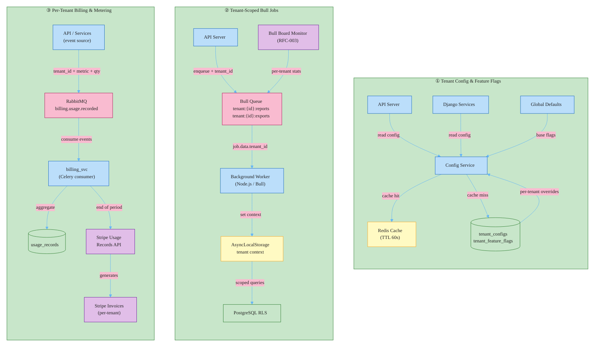

# RFC-005: Tenant Operations — Configuration, Feature Flags, Job Scoping, and Usage Billing

**ID**: RFC-005
**Status**: Accepted
**Proposed by**: Engineering Team
**Created**: 2026-04-19
**Last Updated**: 2026-04-19
**Targets**: Implementation
**Depends on**: RFC-004 (Multi-Tenancy Foundation) — accepted and deployed

## Problem / Motivation

RFC-004 establishes data isolation and context propagation. The operational layer on top of that foundation is missing:

- Enterprise customers on different pricing plans cannot have different feature sets. Enabling a feature for one customer enables it for all.
- Background jobs have no per-tenant scoping. The job monitoring dashboard (RFC-003) cannot surface per-tenant job state. A high-volume tenant can starve jobs queued for other tenants in the same Bull queue.
- Billing is flat-rate. The B2B model requires per-tenant subscriptions and usage-based billing for API calls, seats, and storage. There is no mechanism to track what each tenant consumes.
- Stripe subscriptions are not linked to tenants. The billing_svc cannot report which customer owes what.

## Goals and Non-Goals

### Goals

- Tenant config store: `tenant_configs` PostgreSQL table (tenant_id, key, value, updated_at); read through Redis cache (TTL 60 seconds)
- Feature flags: `tenant_feature_flags` table for per-tenant overrides on top of global defaults; flag evaluation returns the effective value (global default if no per-tenant override exists)
- Bull job queue convention: `tenant:{tenant_id}:{job_type}` — queue name prefix enforced at enqueue time in the API server; worker reads tenant_id from `job.data.tenant_id`, sets AsyncLocalStorage before processing
- Per-tenant Stripe Customer: `stripe_customer_id` column on `shared.tenants`; provisioned on tenant creation via a `tenant.created` RabbitMQ event
- Usage metering: services publish `billing.usage.recorded` events (tenant_id, metric, quantity, occurred_at); billing_svc Celery consumer aggregates to `usage_records` table; billing_svc submits Stripe Usage Records at end of billing period via a scheduled Celery beat task

### Non-Goals

- Real-time config push (SSE, WebSocket) to connected clients — TTL-based cache invalidation is sufficient for operational config
- Feature flag A/B testing, percentage rollouts, or user-level targeting within a tenant
- Self-service config and feature flag management — tenant admins cannot modify flags via UI yet (RFC-006)
- Per-user or per-seat billing within a tenant — per-tenant flat + usage is the initial model
- Metering for the 6 services not in the current C4 — deferred until C4 is updated
- Stripe invoice PDF customization or white-labeled billing statements

## Proposed Solution

### Architecture



### 1. Tenant Config Store

Two new tables in the `shared` schema (accessible by all services):

```python
class TenantConfig(Base):
    __tablename__ = "tenant_configs"
    __table_args__ = {"schema": "shared"}

    tenant_id: Mapped[uuid.UUID] = mapped_column(UUID(as_uuid=True), ForeignKey("shared.tenants.id"), primary_key=True)
    key: Mapped[str] = mapped_column(String(128), primary_key=True)
    value: Mapped[str] = mapped_column(Text, nullable=False)
    updated_at: Mapped[datetime] = mapped_column(DateTime(timezone=True), server_default=func.now(), onupdate=func.now())

class TenantFeatureFlag(Base):
    __tablename__ = "tenant_feature_flags"
    __table_args__ = {"schema": "shared"}

    tenant_id: Mapped[uuid.UUID] = mapped_column(UUID(as_uuid=True), ForeignKey("shared.tenants.id"), primary_key=True)
    flag_key: Mapped[str] = mapped_column(String(128), primary_key=True)
    enabled: Mapped[bool] = mapped_column(Boolean, nullable=False)
    updated_at: Mapped[datetime] = mapped_column(DateTime(timezone=True), server_default=func.now(), onupdate=func.now())
```

**Global defaults** are defined as a Python dict in the codebase (`shared/tenancy/flags.py`). A per-tenant override in `tenant_feature_flags` supersedes the global default. Evaluation:

```python
# shared/tenancy/config.py
GLOBAL_FEATURE_DEFAULTS: dict[str, bool] = {
    "sso_enabled": False,
    "advanced_analytics": False,
    "api_rate_limit_override": False,
    "data_export": True,
}

def is_feature_enabled(session: Session, flag_key: str) -> bool:
    tenant_id = get_current_tenant_id()
    row = session.get(TenantFeatureFlag, (tenant_id, flag_key))
    if row is not None:
        return row.enabled
    return GLOBAL_FEATURE_DEFAULTS.get(flag_key, False)
```

**Redis cache**: each service wraps `is_feature_enabled` with a Redis-cached version (`cache_key = f"tenant:{tenant_id}:flag:{flag_key}"`, TTL 60 seconds). Writes to `tenant_feature_flags` must invalidate the cache key. Cache-aside pattern — no write-through.

`tenant_configs` and `tenant_feature_flags` tables are tenant-agnostic at the RLS level: they are accessed by the admin_context() role (BYPASSRLS) or by explicit WHERE clauses in the config service. These tables are NOT subject to RFC-004's RLS policies — the config service is internal and always reads by explicit tenant_id.

### 2. Tenant-Scoped Bull Jobs

Queue naming convention in the API Server (TypeScript):

```typescript
// src/jobs/tenant-queue.ts
import { tenantStorage } from '../middleware/tenant';
import { Queue } from 'bull';

const queues = new Map<string, Queue>();

function getQueue(jobType: string): Queue {
  const { tenantId } = tenantStorage.getStore()!;
  const queueName = `tenant:${tenantId}:${jobType}`;
  if (!queues.has(queueName)) {
    queues.set(queueName, new Queue(queueName, { redis: redisConfig }));
  }
  return queues.get(queueName)!;
}

export function enqueueJob(jobType: string, payload: object) {
  const { tenantId } = tenantStorage.getStore()!;
  return getQueue(jobType).add({ ...payload, tenant_id: tenantId });
}
```

**Worker side (Background Worker):** the worker subscribes to a wildcard queue pattern `tenant:*:reports`, `tenant:*:exports`. Before processing each job, the worker reads `job.data.tenant_id` and sets AsyncLocalStorage:

```typescript
// src/workers/tenant-worker.ts
import { tenantStorage } from '../middleware/tenant';

export function processTenantJob(processor: (job: Job) => Promise<void>) {
  return async (job: Job) => {
    const tenantId = job.data.tenant_id;
    if (!tenantId) throw new Error(`Job ${job.id} missing tenant_id`);
    await tenantStorage.run({ tenantId }, () => processor(job));
  };
}
```

Bull Board (RFC-003, once implemented) will show per-tenant queue stats because queue names carry the tenant_id prefix. No changes to RFC-003's design are required — Bull Board already enumerates all queues.

### 3. Per-Tenant Billing and Usage Metering

**Stripe Customer provisioning:**

Add `stripe_customer_id: Mapped[str | None]` to `shared.Tenant`. When a new tenant is created, a `tenant.created` event is published via RabbitMQ. `billing_svc` consumes this event and creates a Stripe Customer object:

```python
# billing_svc/events/handlers.py
async def handle_tenant_created(envelope: EventEnvelope) -> None:
    tenant_id = envelope.tenant_id
    tenant = session.get(Tenant, tenant_id)
    customer = stripe.Customer.create(
        name=tenant.name,
        metadata={"tenant_id": str(tenant_id), "tenant_slug": tenant.slug},
    )
    tenant.stripe_customer_id = customer.id
    session.commit()
```

**Usage event schema** (new event type in shared_events):

```python
@dataclass(frozen=True)
class UsageRecordedPayload:
    metric: str          # e.g. "api_calls", "seats", "storage_gb"
    quantity: int
    occurred_at: datetime
```

Published by any service via:
```python
envelope = build_envelope("billing.usage.recorded", UsageRecordedPayload(...).__dict__)
publisher.publish(envelope)
```

**Usage aggregation model:**

```python
class UsageRecord(Base):
    __tablename__ = "usage_records"
    __table_args__ = {"schema": "billing_svc"}

    id: Mapped[uuid.UUID] = mapped_column(UUID(as_uuid=True), primary_key=True, default=uuid.uuid4)
    tenant_id: Mapped[uuid.UUID] = mapped_column(UUID(as_uuid=True), ForeignKey("shared.tenants.id"), nullable=False, index=True)
    metric: Mapped[str] = mapped_column(String(64), nullable=False)
    quantity: Mapped[int] = mapped_column(BigInteger, nullable=False)
    occurred_at: Mapped[datetime] = mapped_column(DateTime(timezone=True), nullable=False)
    reported_to_stripe: Mapped[bool] = mapped_column(Boolean, nullable=False, default=False)
```

**Stripe Usage Records submission**: a Celery beat task runs at the end of each billing period (daily, configurable). It aggregates unreported `usage_records` by tenant + metric and submits to the Stripe Usage Records API:

```python
# billing_svc/tasks/usage_reporter.py
@app.task(base=TenantAwareTask)
def submit_usage_to_stripe() -> None:
    # NOTE: runs in admin_context() — iterates ALL tenants
    with admin_context():
        tenants = session.scalars(select(Tenant).where(
            Tenant.status == TenantStatus.ACTIVE,
            Tenant.stripe_customer_id.isnot(None)
        )).all()

    for tenant in tenants:
        with tenant_context(tenant.id):
            _submit_for_tenant(tenant)
```

`usage_records` is subject to RFC-004 RLS — each tenant's records are isolated. The beat task iterates tenants explicitly and enters `tenant_context()` per iteration.

## Alternatives

### Third-Party Feature Flag Service (LaunchDarkly, Split.io)

Use a managed feature flag service rather than building an in-house config table. LaunchDarkly supports per-tenant targeting natively; Split.io has a similar model.

**Rejected**: LaunchDarkly's enterprise tier starts at ~$200/month and increases with MAUs — at B2B scale with many tenants, cost grows significantly. More critically, per-tenant configuration data (which features each customer has enabled under their contract) would be stored in a third-party system, creating a data residency issue for enterprise customers with GDPR or data sovereignty requirements. The flag evaluation logic needed here — plan-gated defaults with per-tenant overrides — is a 30-line function over a single database table. The managed service adds infrastructure dependency, SDK dependency, external latency on every flag evaluation, and cost without providing meaningful additional capability for our use case.

### Feature Flags in Redis Only (No PostgreSQL)

Store all feature flags and tenant config directly in Redis as hash keys (`HGET tenant:{id}:flags sso_enabled`). Skip the PostgreSQL `tenant_feature_flags` table.

**Rejected**: Redis is an in-memory store with configurable persistence (AOF, RDB). Even with AOF enabled, feature flags written to Redis and not yet fsynced can be lost on an unclean shutdown. Feature flags are operational configuration that directly controls whether enterprise-contracted features are available to paying customers — this data must be in a durable store. PostgreSQL as source of truth with Redis as a read-through cache (TTL 60s) provides both durability and performance. The pure-Redis approach also makes flag change history and audit logging harder (Redis has no built-in change log).

## Impact

- **Files / Modules**:
  - `shared/tenancy/config.py` — new: `TenantConfig`, `TenantFeatureFlag` ORM models, `is_feature_enabled()`, `get_config()`
  - `shared/tenancy/flags.py` — new: `GLOBAL_FEATURE_DEFAULTS` dict
  - `shared_events/payloads.py` — new: `UsageRecordedPayload`, `TenantCreatedPayload`
  - `billing_svc/models.py` — add `stripe_customer_id` to `Tenant`; new `UsageRecord` model
  - `billing_svc/events/handlers.py` — new: `handle_tenant_created`, `handle_usage_recorded`
  - `billing_svc/tasks/usage_reporter.py` — new Celery beat task
  - `src/jobs/tenant-queue.ts` — new: `getQueue()`, `enqueueJob()` with tenant prefix
  - `src/workers/tenant-worker.ts` — new: `processTenantJob()` wrapper
  - `shared/migrations/0003_add_tenant_config_tables.py` — new: `tenant_configs`, `tenant_feature_flags` tables
  - `billing_svc/migrations/0003_add_usage_records.py` — new: `usage_records` table, `stripe_customer_id` on tenants
- **C4**: None — no new containers. Notes updated: Redis description updated to include config cache. billing_svc description updated to include usage metering and Stripe Customer management.
- **ADRs**: None — builds directly on RFC-004 patterns.
- **Breaking changes**: No — all new tables and endpoints. Existing Bull job enqueueing must be migrated to use `enqueueJob()` from `tenant-queue.ts` (can be done incrementally; old jobs without queue prefix continue to work until all callers are migrated).

## Open Questions

- [ ] Usage metering granularity: should `billing.usage.recorded` events be emitted per-API-call (high volume) or batched at middleware level (e.g., count per minute)? High-volume-per-call events may overwhelm RabbitMQ at scale. **must resolve**
- [ ] Stripe subscription model: flat-rate per tenant + usage overages (metered billing), or pure usage-based? This determines how Stripe Products and Prices are structured. **must resolve**
- [ ] Config cache invalidation: when `tenant_feature_flags` is written, who is responsible for deleting the Redis cache key — the writer via application code, or a PostgreSQL NOTIFY trigger? Application-level invalidation is simpler; trigger-based invalidation is more reliable if multiple services write flags. **can defer**
- [ ] Bull wildcard queue subscription: Bull does not natively support wildcard queue subscriptions. The worker needs to enumerate active tenant queues from Redis to subscribe. Strategy: poll Redis for `tenant:*:reports` keys every 30s, or use a central queue registry table. **must resolve**

---

## Change Log

- 2026-04-19: Initial draft
- 2026-04-19: Status → In Review
