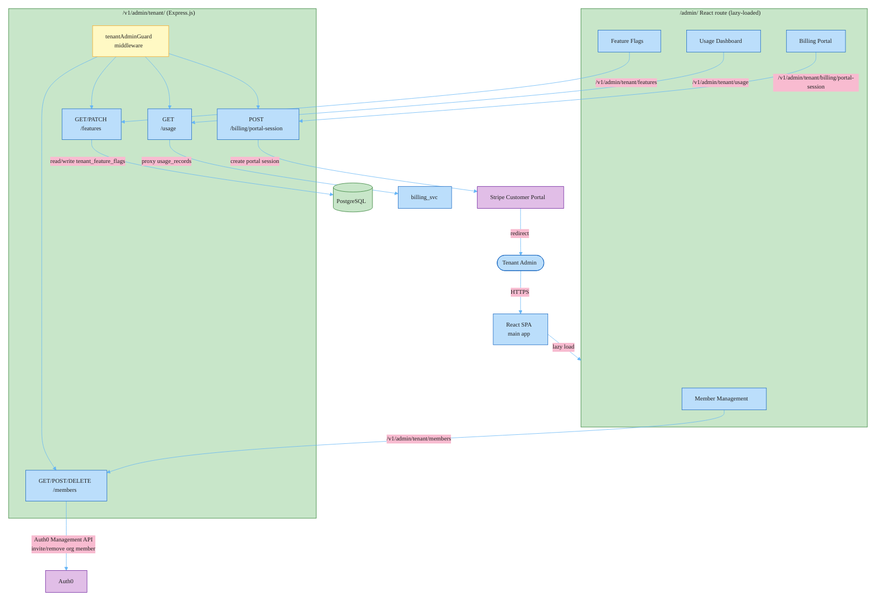

# RFC-006: Tenant Admin Portal — Self-Service Member and Configuration Management

**ID**: RFC-006
**Status**: Accepted
**Proposed by**: Engineering Team
**Created**: 2026-04-19
**Last Updated**: 2026-04-19
**Targets**: Implementation, C4
**Depends on**: RFC-004 (Multi-Tenancy Foundation), RFC-005 (Tenant Operations)

## Problem / Motivation

Enterprise customers need self-service management for their tenant environment. Currently:

- Adding or removing members from a tenant requires an engineering team ticket.
- Feature flag overrides and per-tenant configuration require direct database access or an internal ops tool.
- Tenant administrators have no visibility into their usage against quota limits.
- Billing management (updating payment methods, downloading invoices) requires contacting support or accessing Stripe directly.

The absence of a self-service portal means engineering and support carry operational load that scales linearly with tenant count. At 10 enterprise customers this is manageable; at 100 it is not.

## Goals and Non-Goals

### Goals

- New tenant-admin role gated React SPA route at `/admin/` — lazy-loaded, not included in the main bundle for non-admin users
- New Express.js API namespace `/v1/admin/tenant/` with `tenantAdminGuard` middleware enforcing the `tenant_admin` role
- Member management: list, invite (send Auth0 Organization invite), and remove tenant members
- Feature flag overrides: list effective flags (global default + tenant override), toggle per-tenant overrides within plan limits
- Usage dashboard: current billing period usage vs. quota per metric (`api_calls`, `seats`, `storage_gb`)
- Billing portal: Stripe Customer Portal session endpoint — tenant admin redirected to hosted Stripe portal for payment method and invoice management

### Non-Goals

- Platform-level admin portal for internal ops team (managing tenants, viewing cross-tenant data) — separate internal tool
- Tenant creation and provisioning UI — remains an internal ops process
- Custom branding, white-labeling, or custom domain per tenant
- Multi-language i18n
- SCIM provisioning integration — Auth0 Organization invites only

## Proposed Solution

### Architecture



### 1. React Admin Route

The admin portal is a lazy-loaded route within the existing React SPA. No new deployment — the admin bundle is code-split and only downloaded by users with the `tenant_admin` role:

```typescript
// src/routes/index.tsx
const AdminPortal = React.lazy(() => import('./admin/AdminPortal'));

<Route
  path="/admin/*"
  element={
    <RequireRole role="tenant_admin">
      <Suspense fallback={<AdminSkeleton />}>
        <AdminPortal />
      </Suspense>
    </RequireRole>
  }
/>
```

`RequireRole` reads the `roles` claim from the JWT (set by Auth0 Action). Non-admin users attempting to navigate to `/admin/` are redirected to `/`.

**Admin portal routes:**

| Path | Component | API |
|------|-----------|-----|
| `/admin/members` | MemberList, InviteForm | GET/POST/DELETE /v1/admin/tenant/members |
| `/admin/features` | FeatureFlagList | GET/PATCH /v1/admin/tenant/features |
| `/admin/usage` | UsageDashboard | GET /v1/admin/tenant/usage |
| `/admin/billing` | BillingPortalRedirect | POST /v1/admin/tenant/billing/portal-session |

### 2. API Namespace and Guard Middleware

New Express route namespace, mounted after existing versioned routes:

```typescript
// src/routes/admin/index.ts
import { tenantAdminGuard } from '../../middleware/tenant-admin-guard';

const adminRouter = Router();
adminRouter.use(tenantMiddleware);       // from RFC-004
adminRouter.use(tenantAdminGuard);      // new: enforces tenant_admin role

adminRouter.get('/members', listMembers);
adminRouter.post('/members', inviteMember);
adminRouter.delete('/members/:userId', removeMember);
adminRouter.get('/features', listFeatures);
adminRouter.patch('/features/:flagKey', updateFeatureFlag);
adminRouter.get('/usage', getUsage);
adminRouter.post('/billing/portal-session', createBillingPortalSession);

app.use('/v1/admin/tenant', adminRouter);
```

`tenantAdminGuard` checks the `roles` claim in the JWT (Auth0 sets this via a custom Action based on Auth0 Organization membership role):

```typescript
// src/middleware/tenant-admin-guard.ts
export function tenantAdminGuard(req, res, next) {
  const roles: string[] = req.auth?.['https://yourapp.com/roles'] ?? [];
  if (!roles.includes('tenant_admin')) {
    return res.status(403).json({ error: 'Tenant admin role required' });
  }
  next();
}
```

### 3. Member Management

Members are managed via the Auth0 Management API. The API Server calls Auth0 on behalf of the tenant admin — the platform does not store member data beyond what Auth0 Organizations provides:

```typescript
// src/routes/admin/members.ts
export async function inviteMember(req, res) {
  const { email, role } = req.body;
  const { tenantId } = tenantStorage.getStore()!;
  const tenant = await getTenantById(tenantId);

  await auth0ManagementClient.organizations.createInvitation(
    { id: tenant.auth0_org_id },
    { invitee: { email }, inviter: { name: req.auth.name }, roles: [role] }
  );
  res.status(202).json({ message: 'Invitation sent' });
}
```

Member removal calls `auth0ManagementClient.organizations.deleteMember()`. Both operations are audit-logged to `admin_audit_log` table (cross-tenant, BYPASSRLS) with actor, action, and timestamp.

### 4. Feature Flag Management

Reads delegate to RFC-005's `is_feature_enabled()`. Writes enforce plan limits — a `STARTER` plan tenant cannot enable `advanced_analytics` regardless of what the request body contains:

```typescript
// src/routes/admin/features.ts
export async function updateFeatureFlag(req, res) {
  const { flagKey } = req.params;
  const { enabled } = req.body;

  // Check if flag is plan-gated; reject if tenant's plan doesn't allow override
  const allowed = await planAllowsFeature(tenantId, flagKey);
  if (!allowed) {
    return res.status(403).json({ error: `Feature '${flagKey}' requires plan upgrade` });
  }

  await db.query(
    `INSERT INTO shared.tenant_feature_flags (tenant_id, flag_key, enabled)
     VALUES ($1, $2, $3)
     ON CONFLICT (tenant_id, flag_key) DO UPDATE SET enabled = $3, updated_at = now()`,
    [tenantId, flagKey, enabled]
  );
  await redis.del(`tenant:${tenantId}:flag:${flagKey}`); // invalidate cache

  res.json({ flag_key: flagKey, enabled });
}
```

`planAllowsFeature()` checks `PLAN_FEATURE_GATES` — a static map of `{ plan: { flagKey: boolean } }` defined in the codebase. Plan upgrades are handled via billing (RFC-005), not the admin portal.

### 5. Usage Dashboard

The usage endpoint proxies to billing_svc to avoid duplicating the aggregation logic:

```typescript
// src/routes/admin/usage.ts
export async function getUsage(req, res) {
  const { tenantId } = tenantStorage.getStore()!;
  const period = req.query.period ?? 'current';  // 'current' | 'YYYY-MM'

  const usage = await billingServiceClient.get(`/internal/usage/${tenantId}?period=${period}`, {
    headers: { 'X-Tenant-ID': tenantId }
  });
  res.json(usage.data);
}
```

`billing_svc` exposes a new internal endpoint `GET /internal/usage/:tenant_id` that returns aggregated usage from `usage_records` for the requested period. This endpoint is not publicly routed — only accessible from the API Server's internal network.

### 6. Stripe Customer Portal

The billing portal embeds Stripe's hosted Customer Portal. The API Server creates a portal session and redirects:

```typescript
// src/routes/admin/billing.ts
export async function createBillingPortalSession(req, res) {
  const { tenantId } = tenantStorage.getStore()!;
  const tenant = await getTenantById(tenantId);

  if (!tenant.stripe_customer_id) {
    return res.status(400).json({ error: 'No Stripe subscription found' });
  }

  const session = await stripe.billingPortal.sessions.create({
    customer: tenant.stripe_customer_id,
    return_url: `${process.env.APP_BASE_URL}/admin/billing`,
  });

  res.json({ url: session.url });
}
```

The React `BillingPortalRedirect` component calls this endpoint and redirects to `session.url`. The tenant admin manages payment methods, downloads invoices, and reviews subscription history inside Stripe's hosted portal. On completion, Stripe redirects back to `/admin/billing`.

## Alternatives

### Standalone Admin SPA (Separate Deployment)

Deploy the tenant admin portal as a separate React application with its own domain (`admin.yourapp.com`), CI/CD pipeline, and auth configuration. Keeps admin concerns completely separate from the main product application.

**Rejected**: Adds a second frontend deployment to manage — separate build pipeline, separate CDN config, separate Auth0 application registration. Tenant admins would need a separate login flow. The isolation benefit is available through React's lazy loading and route-level role guards without operational overhead. A separate deployment would also duplicate the API client setup and auth token handling. The main tradeoff — admin code in the same repo as product code — is acceptable; admin routes are clearly namespaced at `/admin/` and the lazy bundle is only downloaded by admin users.

### Custom Billing UI (Without Stripe Customer Portal)

Build the payment method management, invoice listing, and subscription status screens as first-party React components backed by Stripe API calls proxied through the API Server.

**Rejected**: Stripe Customer Portal provides payment method management (including 3D Secure flows), invoice PDF download, subscription pause/cancel, and payment history — all out of the box. Building equivalent functionality is 2-3 weeks of frontend work for features that are better maintained by Stripe. Custom billing UI also requires PCI SAQ A-EP compliance for payment method display (showing last 4 digits, expiry), which Stripe Customer Portal handles via their iframe with PCI-compliant card display. Using the portal means we never render payment method data in our application. This is the cleaner compliance posture for an enterprise product.

## Impact

- **Files / Modules**:
  - `src/admin/` — new lazy React module: `AdminPortal.tsx`, `MemberList.tsx`, `InviteForm.tsx`, `FeatureFlagList.tsx`, `UsageDashboard.tsx`, `BillingPortalRedirect.tsx`
  - `src/routes/admin/` — new Express routes: `members.ts`, `features.ts`, `usage.ts`, `billing.ts`, `index.ts`
  - `src/middleware/tenant-admin-guard.ts` — new middleware
  - `billing_svc/views/internal.py` — new: `GET /internal/usage/:tenant_id` endpoint
  - `shared/migrations/0004_add_admin_audit_log.py` — new: `admin_audit_log` table (cross-tenant)
  - Auth0 Action — new: inject `roles` claim from Auth0 Organization member role
- **C4**: Web App container — update description to mention tenant admin portal. API Server container — update description to mention `/v1/admin/tenant/` namespace. No new containers.
- **ADRs**: None — no new architectural decisions; builds on existing patterns.
- **Breaking changes**: No — additive new routes and lazy-loaded module. Existing users see no change unless they have the `tenant_admin` role in their JWT.

## Open Questions

- [ ] Auth0 Organization roles: does the current Auth0 plan support custom organization member roles (`tenant_admin`, `tenant_member`)? Verify before building the role-based guard. **must resolve**
- [ ] `billing_svc` internal endpoint: should the internal usage API be authenticated with a service-to-service JWT or rely on network-level isolation (VPC)? Network isolation is sufficient in current infra, but explicit authentication is more portable. **can defer**
- [ ] Feature flag plan gating: `PLAN_FEATURE_GATES` as a static code map vs. a `plan_feature_entitlements` table in PostgreSQL? Code map is simpler to reason about but requires a deploy for plan changes. DB table allows ops team to update entitlements without a deploy. **can defer**
- [ ] Admin audit log retention: how long should `admin_audit_log` entries be retained? Enterprise customers may require 1-year audit trail for compliance. **can defer**

---

## Change Log

- 2026-04-19: Initial draft
- 2026-04-19: Status → In Review
