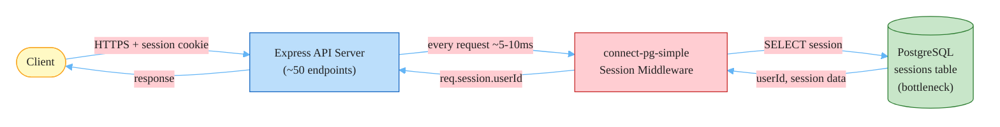
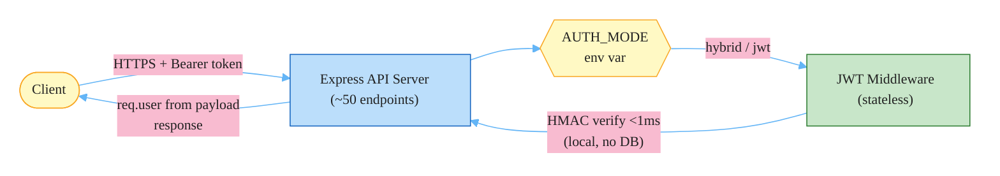
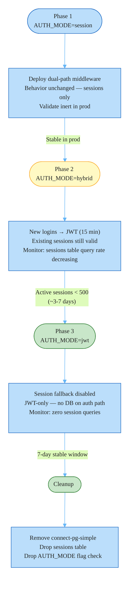

# RFC-004: Session-to-JWT Auth Migration

**ID**: RFC-004
**Status**: Accepted
**Proposed by**: Engineering Team
**Created**: 2026-04-19
**Last Updated**: 2026-04-19
**Targets**: Implementation, ADR

## Problem / Motivation

Every API request authenticates by querying the `sessions` table in PostgreSQL via `connect-pg-simple`. At 10k concurrent users this table has become a read bottleneck: each of the ~50 authenticated endpoints adds a synchronous database round-trip (~5-10ms) before any business logic runs. The sessions table absorbs a disproportionate share of the PostgreSQL connection pool, causing connection queue stalls during traffic spikes.

Horizontal scaling provides no relief. Each additional API server instance still hits the same sessions table, increasing load on the shared bottleneck rather than distributing it. Stateless JWT authentication eliminates the per-request database read entirely: token validation is a local HMAC computation with no network dependency.

**C4 discrepancy**: the container diagram lists Redis as the session store ("Cache / Sessions: Redis 7 — Session storage..."), but the actual implementation uses `connect-pg-simple` on PostgreSQL. This RFC reflects the actual state; the C4 will be corrected as part of the Impact section.

## Goals and Non-Goals

### Goals

- Eliminate per-request PostgreSQL session lookups across all ~50 API endpoints via stateless JWT validation
- Zero customer-visible downtime: migrate using a three-phase feature flag (`AUTH_MODE`) with instant rollback capability at each phase
- Define JWT token structure, signing key management, and middleware design
- Create an ADR recording the JWT auth decision, signing algorithm, and expiry policy

### Non-Goals

- Implementing refresh token rotation — this will be addressed in a separate, subsequent RFC
- Changing the identity provider (Auth0 remains for initial user authentication; the application-level session is what is being replaced)
- Migrating internal service-to-service authentication (background worker jobs, RabbitMQ event consumers)
- Mandating a client-side token storage strategy — callers decide between localStorage, httpOnly cookie, or in-memory

## Proposed Solution

Three-phase feature-flag migration controlled by a single environment variable `AUTH_MODE` with values `session | hybrid | jwt`.

**Phase 1 — Inert deploy** (`AUTH_MODE=session`): Ship the dual-path auth middleware with sessions behavior unchanged. Validates the new code is safe in production before switching any behavior.

**Phase 2 — Hybrid** (`AUTH_MODE=hybrid`): The login endpoint now issues a signed JWT (15-min expiry) instead of creating a PostgreSQL session. Existing sessions remain valid. Each request checks for an `Authorization: Bearer` header first; falls back to session lookup if absent. PostgreSQL session table load decreases as existing sessions expire and new logins accumulate as JWT holders.

**Phase 3 — JWT-only** (`AUTH_MODE=jwt`): When active session count drops below 500 (expected within 3-7 days of enabling hybrid), the session lookup path is disabled. After a further 7-day monitoring window, remove the `connect-pg-simple` dependency and sessions table.

### Token Design

- **Algorithm**: HMAC-SHA256 (`HS256`) using a 256-bit secret from `JWT_SECRET` environment variable
- **Claims**: `sub` (user ID string), `email`, `roles` (string array), `iat`, `exp`
- **Expiry**: 15 minutes
- **Transport**: `Authorization: Bearer <token>` header
- **No refresh tokens** in this RFC

### Middleware Design

```typescript
// src/middleware/auth.ts
export async function authMiddleware(
  req: Request,
  res: Response,
  next: NextFunction
): Promise<void> {
  const authHeader = req.headers.authorization;
  const AUTH_MODE = process.env.AUTH_MODE ?? 'session';

  if (
    authHeader?.startsWith('Bearer ') &&
    (AUTH_MODE === 'jwt' || AUTH_MODE === 'hybrid')
  ) {
    try {
      const token = authHeader.slice(7);
      const payload = jwt.verify(token, process.env.JWT_SECRET!) as JwtPayload;
      req.user = { id: payload.sub!, email: payload.email, roles: payload.roles };
      return next();
    } catch {
      res.status(401).json({ error: 'Invalid or expired token' });
      return;
    }
  }

  if (AUTH_MODE === 'session' || AUTH_MODE === 'hybrid') {
    if (req.session?.userId) {
      req.user = await getUserFromSession(req.session.userId);
      return next();
    }
  }

  res.status(401).json({ error: 'Authentication required' });
}
```

All 50 existing endpoints read from `req.user.id` — no endpoint-level changes required. The `req.user` shape is unchanged.

### Architecture: Before



### Architecture: After



### Migration Sequence



## Alternatives

### Big-bang cutover

Replace all 50 endpoints' session middleware with JWT in a single release. No feature flag; sessions disabled on the release date; all clients must send `Authorization: Bearer` tokens from day one.

**Rejected**: No rollback path once `connect-pg-simple` is disabled — recovery requires a full re-deploy plus repopulating session state. Any defect in JWT verification (clock skew handling, algorithm mismatch, claims parsing) causes a global authentication outage across all 50 endpoints simultaneously. Requires coordinating all API clients — web app, mobile clients, partner integrations — to ship Bearer token support before the cutover date. At 10k concurrent users the forced client synchronization deadline and all-or-nothing outage risk are unacceptable.

### Redis-backed sessions

Replace `connect-pg-simple` with `connect-redis`, using the Redis instance already in the stack. Keep session-based auth; eliminate the PostgreSQL sessions bottleneck by moving to a faster store.

**Rejected**: Redis still requires a per-request network hop for session lookup (~0.2-0.5ms vs PostgreSQL's ~5-10ms). Faster, but still a shared stateful dependency that constrains horizontal scaling. At continued growth a Redis cluster would be required, adding infrastructure and operational overhead. More fundamentally, this approach defers the architectural goal — future scaling past Redis capacity requires revisiting auth architecture again. JWT solves the scaling problem permanently with the same migration effort. This alternative also reveals a discrepancy: the C4 container diagram already shows Redis as the session store, yet the actual implementation uses PostgreSQL, suggesting the Redis path was already explored and skipped over.

## Impact

- **Files / Modules**:
  - `src/middleware/auth.ts` — replace session-only check with dual-path JWT/session logic; read `AUTH_MODE` from `process.env`
  - `src/routes/auth.ts` — update `/login` handler to issue JWT via `jsonwebtoken.sign()` instead of creating a PostgreSQL session
  - `src/lib/jwt.ts` — new: exports `signToken(payload)` and `verifyToken(token)` wrappers with algorithm and expiry configured
  - `src/types/express.d.ts` — update `Request.user` type to reflect JWT payload fields (`id`, `email`, `roles`) consistent with the current session-derived shape
  - `package.json` — add `jsonwebtoken`, `@types/jsonwebtoken`; remove `connect-pg-simple` and `@types/connect-pg-simple` post-migration
- **C4**: Container diagram update required — "Cache / Sessions" container description currently lists session storage under Redis, but actual implementation uses PostgreSQL via `connect-pg-simple`. After migration, the application-level session store is eliminated entirely (no Redis sessions, no PostgreSQL sessions). API Server container description updated to note JWT stateless auth. No new containers.
- **ADRs**: New ADR to record: JWT as the application session mechanism, HMAC-SHA256 (`HS256`) with environment-provided 256-bit secret as the signing approach, 15-minute access token expiry, and why Redis-backed sessions were not chosen.
- **Breaking changes**: Phases 1 and 2 — none. Phase 3 (`AUTH_MODE=jwt`): clients sending only session cookies without a Bearer token receive `401 Authentication required`. Client teams (web app, mobile, partner integrations) must ship Bearer token support before the Phase 3 cutover is triggered.

## Open Questions

- [ ] Session invalidation during migration: when switching to `AUTH_MODE=jwt` (Phase 3), should existing active sessions be force-invalidated immediately (truncate the sessions table) or allowed to drain naturally via their existing TTL? Force-invalidation is operationally cleaner — the session code path can be disabled without a drain window — but logs out all currently-sessioned users simultaneously. Natural expiry is gentler but extends the dual-path code's active lifetime by the full session TTL. — **must resolve before Phase 3 cutover**
- [ ] JWT signing key rotation: what is the procedure for rotating `JWT_SECRET` without invalidating all in-flight 15-minute tokens? Options include a grace-period dual-secret accept (verify with new key, fall back to old key for the remaining TTL) or accepting a brief forced re-login for all users during rotation. — **must resolve before production JWT issuance**
- [ ] Active session drain threshold: is `< 500 active sessions` the right trigger for the Phase 2 → Phase 3 cutover? The correct threshold depends on peak-hour session counts; revisit after Phase 2 monitoring data is available. — **can defer to Phase 2**

---

## Change Log

- 2026-04-19: Initial draft — three approaches presented (big-bang, hybrid feature flag, endpoint-by-endpoint); hybrid feature-flag migration selected
- 2026-04-19: Added non-goal: refresh token rotation deferred to separate RFC; added open question on session invalidation strategy (force vs natural expiry) at Phase 3 cutover
- 2026-04-19: Status → In Review
