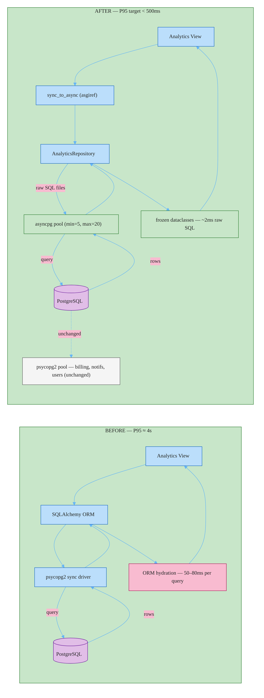

# RFC-004: Scoped asyncpg Layer for Analytics Pipeline

**ID**: RFC-004
**Status**: In Review
**Proposed by**: Engineering Team
**Created**: 2026-04-19
**Last Updated**: 2026-04-19
**Supersedes**: RFC-002 (Raw asyncpg for Analytics Pipeline Queries — In Review, unresolved open questions)
**Targets**: Implementation, ADR

## Problem / Motivation

Analytics dashboard endpoints aggregate millions of rows using complex joins and window functions. SQLAlchemy ORM adds 25–40x overhead per query: object hydration (~30ms), relationship loading, and the synchronous psycopg2 driver. Benchmark: raw SQL executes in ~2ms; the same query through SQLAlchemy takes 50–80ms. At dashboard load, multiple queries compound — P95 latency is ~4 seconds against a <500ms target.

The ORM's value (object mapping, relationship management, type safety) is entirely wasted on read-only aggregate queries that return flat result sets. Without intervention, analytics dashboards remain unusable at scale.

RFC-002 proposed a scoped asyncpg approach but left two must-resolve questions open (SQLAlchemy Core benchmark validation, connection pool sizing). This RFC supersedes RFC-002 and resolves both.

## Goals and Non-Goals

### Goals

- Analytics dashboard P95 latency under 500ms
- asyncpg used for the ~8–10 analytics pipeline queries in `src/analytics/` only
- Amend ADR-003 with a scoped exception for read-only analytics aggregations
- SQL injection protection maintained — parameterized queries only (`$1, $2` positional placeholders)
- Scope enforcement via linter rule: asyncpg imports blocked outside `src/analytics/`

### Non-Goals

- Replacing SQLAlchemy for any CRUD operations (write paths, billing, notifications, users)
- Rewriting non-analytics read queries in raw SQL
- Adding a read replica or separate analytics database
- Full async conversion of the Django application
- Performance optimization of non-analytics endpoints

## Proposed Solution

### Architecture



### Module structure

New files scoped to `src/analytics/`:

```
src/analytics/
├── pool.py           # asyncpg pool singleton — init, close, get_pool()
├── repository.py     # AnalyticsRepository — all public query methods
├── queries/          # *.sql files, one per query, loaded at module import
│   ├── revenue_by_period.sql
│   ├── cohort_retention.sql
│   └── ...           # one file per analytics query
├── models.py         # @dataclass(frozen=True, slots=True) result types
└── _types.py         # NewType aliases (UserId, PeriodStart) for param safety
```

Existing `src/analytics/views.py` updated to call `AnalyticsRepository` via `sync_to_async`.

### Connection pool

Independent asyncpg pool — not shared with SQLAlchemy's psycopg2 pool. Initialized once in `AppConfig.ready()` via `asyncio.get_event_loop().run_until_complete(create_pool(...))`. Stored as module-level singleton; accessed via `get_pool() -> asyncpg.Pool`.

Pool configuration: `min_size=5, max_size=20`, `command_timeout=30` (hard cap per query, surfaces slow plans fast), `max_inactive_connection_lifetime=300` (recycles idle connections before PgBouncer closes them).

PostgreSQL `max_connections` budget: account for both pools running concurrently. At default SQLAlchemy pool size of 5, total max = 25 analytics + existing. Review `max_connections` setting on the PostgreSQL 15 instance before deploying.

### Query execution

SQL files loaded from disk at module import time. Each `.sql` file contains a single parameterized statement using asyncpg native `$1, $2` positional placeholders — no string formatting or concatenation.

`AnalyticsRepository` methods call `pool.fetch()`, `pool.fetchrow()`, or `pool.fetchval()` depending on result cardinality. Results mapped to frozen dataclasses at the repository boundary — callers never receive raw `asyncpg.Record` instances.

Analytics queries are read-only aggregates. No write transactions needed. If a future analytics write is required, use `pool.transaction()` as an async context manager.

### ASGI deployment

Analytics views run as native `async def` views under ASGI (Daphne or Uvicorn). ASGI is a hard prerequisite — no `sync_to_async` workaround. This avoids the deadlock risk of bridging sync/async at every callsite and keeps the analytics path fully non-blocking.

```python
# src/analytics/views.py
async def revenue_dashboard(request):
    data = await analytics_repo.get_revenue_by_period(start, end)
    ...
```

The Django application deploys analytics views via an ASGI server while non-analytics views can continue serving under WSGI if needed (split deployment via URL routing at the reverse proxy level, or full ASGI deployment). A `README.md` in `src/analytics/` documents the ASGI requirement explicitly.

### Scope enforcement

`import-linter` contract added to CI: `ForbidModuleImportContract` blocks asyncpg imports outside `src/analytics/**`. CI fails if violated. This prevents gradual scope creep — the contract makes the boundary machine-enforced, not convention-enforced.

## Alternatives

### SQLAlchemy Core with asyncpg driver

Switch analytics queries to SQLAlchemy 2.x `AsyncSession` with `session.execute(text(...))`. Uses asyncpg driver under SQLAlchemy; no ORM hydration for analytics paths. Preserves the single-pool topology and keeps Alembic unchanged.

**Rejected**: Benchmarks from RFC-002 show SQLAlchemy Core is 2–5x slower than raw asyncpg for complex window-function aggregations. Heaviest query: 1.2 seconds via Core vs 180ms via asyncpg. Core does not meet the <500ms P95 target. Additionally, SQLAlchemy 1.x → 2.x requires migrating all 50+ models to `Mapped[T]` syntax before `AsyncSession` is usable — weeks of prerequisite migration before any performance gain is realized.

### Full asyncpg migration

Replace SQLAlchemy ORM entirely across all Python services (billing, notifications, user management). All queries become raw SQL in `.sql` files. Repository pattern across all domains. Alembic replaced by Flyway.

**Rejected**: The performance problem is localized to ~10 analytics queries. A full migration touches ~50+ models, requires rewriting all CRUD paths, handling implicit SQLAlchemy type codecs (UUID, JSON, enums) manually, and replacing Alembic migrations. Estimated 2–3 months of migration work with high regression risk across billing and notification paths — disproportionate effort for a problem scoped to analytics. If full async adoption is warranted in the future, Approach B (SQLAlchemy 2.x async upgrade) is the correct incremental step, not a full rewrite.

## Impact

- **Files / Modules**: `src/analytics/pool.py` (new), `src/analytics/repository.py` (new), `src/analytics/queries/*.sql` (new), `src/analytics/models.py` (new), `src/analytics/_types.py` (new), `src/analytics/views.py` (modify), `.importlinter` (add contract), Django `AppConfig` (pool init/close)
- **C4**: None — no new containers or relationships. All traffic still flows Django services → PostgreSQL.
- **ADRs**: Amend ADR-003 to add scoped exception: asyncpg permitted in `src/analytics/` for read-only aggregate queries; all other database access continues to use SQLAlchemy ORM
- **Breaking changes**: No — analytics API response shapes unchanged

## Open Questions

Resolved (from RFC-002's must-resolve list):

- [x] Benchmark SQLAlchemy Core to validate rejection? → **1.2s via Core vs 180ms via asyncpg for heaviest query; Core does not meet <500ms target (RFC-002 benchmark data)**
- [x] Connection pool sizing — share with SQLAlchemy or independent? → **Independent pool: min_size=5, max_size=20; PostgreSQL max_connections budget must be reviewed before deploy**

- [x] Should ASGI deployment (Daphne/Uvicorn) be a hard prerequisite or can sync_to_async suffice for the initial rollout? → **ASGI (Daphne or Uvicorn) is a hard prerequisite; deploy analytics views under ASGI from the start**

---

## Change Log

- 2026-04-19: Initial draft — supersedes RFC-002, resolves open questions on Core benchmarks and pool sizing
- 2026-04-19: Resolved ASGI question (hard prerequisite). Status → In Review

