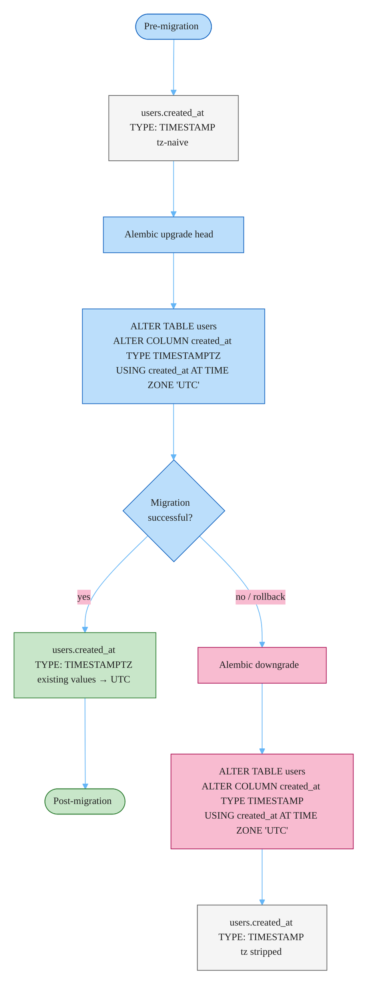
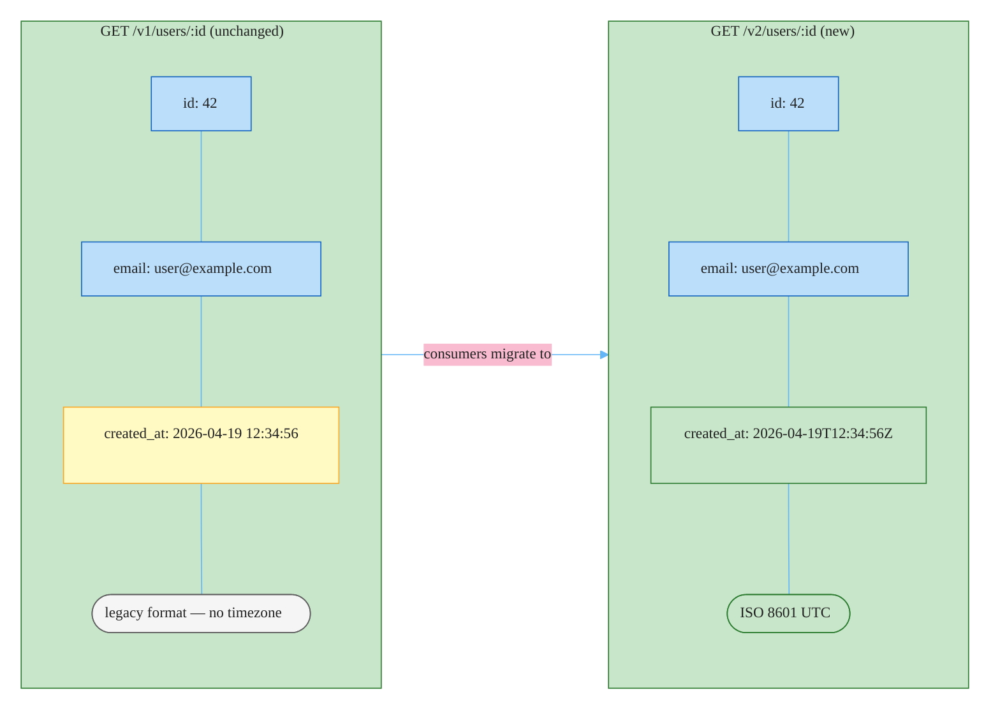

# RFC-004: Migrate `users.created_at` to TIMESTAMPTZ with ISO 8601 API Serialization

**ID**: RFC-004
**Status**: In Review
**Proposed by**: mcuste
**Created**: 2026-04-19
**Last Updated**: 2026-04-19
**Targets**: Implementation

## Problem / Motivation

`users.created_at` is stored as a naive `TIMESTAMP` (no timezone). All writes have historically assumed UTC, but the column carries no enforcement — there is no way to distinguish a stored value that genuinely represents UTC from one that doesn't. This makes cross-timezone user activity analysis ambiguous and will cause subtle bugs as the platform expands to regions where servers or clients operate in non-UTC zones.

The three user profile endpoints serialize `created_at` in an unspecified format. API consumers must guess or hard-code parsing logic. ISO 8601 with an explicit UTC offset eliminates the ambiguity and aligns with how every other date field in the broader platform ecosystem is expected to be represented.

## Goals and Non-Goals

### Goals

- Migrate `users.created_at` from `TIMESTAMP` to `TIMESTAMPTZ`, interpreting all existing values as UTC
- Introduce `/v2/` user profile endpoints that serialize `created_at` as ISO 8601 (`2026-04-19T12:34:56Z`)
- Deprecate the three affected `/v1/` user profile endpoints per ADR-001's 6-month sunset policy
- Leave all `/v1/` response shapes byte-for-byte identical (zero breakage for existing consumers)

### Non-Goals

- Migrating other date/time columns in `users` or any other table
- Changing serialization of any field other than `created_at`
- Removing `/v1/` endpoints within this RFC (sunset handled separately)
- Adding timezone conversion or localization at the API layer
- Auditing whether other services store dates correctly

## Proposed Solution

### Database Migration

Alembic migration using `op.execute()` raw DDL — required because Alembic's `op.alter_column()` does not support the `USING` clause needed for a type cast. Existing values are reinterpreted as UTC via PostgreSQL's `AT TIME ZONE` expression:

```python
# migrations/versions/xxxx_created_at_timestamptz.py

def upgrade() -> None:
    op.execute(
        "ALTER TABLE users "
        "ALTER COLUMN created_at TYPE TIMESTAMPTZ "
        "USING created_at AT TIME ZONE 'UTC'"
    )

def downgrade() -> None:
    op.execute(
        "ALTER TABLE users "
        "ALTER COLUMN created_at TYPE TIMESTAMP "
        "USING created_at AT TIME ZONE 'UTC'"
    )
```

The `AT TIME ZONE 'UTC'` cast does not shift any clock values — it attaches UTC metadata to the existing naive values. The downgrade inverse strips timezone info and is safe because all values were UTC.

**Lock warning**: `ALTER TABLE ... TYPE` acquires `AccessExclusiveLock` for the full table rewrite, blocking all writes. Coordinate a maintenance window or use `pg_repack` if the `users` table is large (see Open Questions).

#### Migration sequence



### SQLAlchemy Model

```python
# user_svc/domain/models.py  (before)
created_at: Mapped[datetime] = mapped_column(DateTime, default=datetime.utcnow)

# user_svc/domain/models.py  (after)
from datetime import datetime, timezone
created_at: Mapped[datetime] = mapped_column(
    DateTime(timezone=True),
    default=lambda: datetime.now(timezone.utc),
)
```

`datetime.utcnow` is deprecated since Python 3.12 and rejected by `asyncpg` when writing to `TIMESTAMPTZ` columns. Replace with `datetime.now(timezone.utc)` throughout any code path that constructs a `created_at` value.

### v2 API Endpoints

Three new route handlers mirror the existing `/v1/` user profile endpoints under `/v2/`. Only the `created_at` field differs — all other response fields are identical to v1. The v2 Pydantic response model uses a `@field_serializer` to produce the ISO 8601 string at the API boundary without polluting the domain model:

```python
# user_svc/api/v2/users.py
from pydantic import BaseModel, ConfigDict, field_serializer
from datetime import datetime, timezone

class UserProfileV2(BaseModel):
    model_config = ConfigDict(from_attributes=True)

    id: int
    email: str
    # ... same fields as v1 ...
    created_at: datetime

    @field_serializer("created_at")
    def serialize_created_at(self, value: datetime) -> str:
        return value.astimezone(timezone.utc).strftime("%Y-%m-%dT%H:%M:%SZ")
```

#### Before/After response shape



### v1 Deprecation

Add `Deprecation` and `Sunset` response headers to the three affected v1 endpoints on acceptance. The sunset date is calculated as 6 months from acceptance per ADR-001's sunset policy.

## Alternatives

### In-place update of `/v1/` endpoints

Update existing `/v1/` user profile endpoints to return ISO 8601 directly, skipping the v2 introduction. The DB migration is identical; only the API layer differs.

**Rejected**: This is a breaking change for any consumer that parses `created_at` from the current format. ADR-001 was adopted in March 2026 explicitly because three client-breaking incidents in Q4 2025 demonstrated the cost of in-place format changes. Making this exception would immediately establish a precedent that breaks the versioning contract. The extra effort of a v2 namespace is the designed cost of a breaking change under ADR-001.

### Two-phase migration with a response format feature flag

Decouple the DB migration (Phase 1) from the serialization change (Phase 2). During the transition, a query parameter or header toggles between formats, allowing consumers to opt in before the cutover.

**Rejected**: A query/header toggle is another versioning scheme layered on top of ADR-001's URL-path versioning — two concurrent versioning mechanisms for the same resource. The operational cost (flag lifecycle, documentation, support for two concurrent response shapes on the same endpoint) is higher than simply introducing `/v2/`. ADR-001 already provides a clean opt-in mechanism via URL path.

## Impact

- **Files / Modules**:
  - `user_svc/migrations/versions/xxxx_created_at_timestamptz.py` — new Alembic migration
  - `user_svc/domain/models.py` — `DateTime` → `DateTime(timezone=True)`, `utcnow` → `datetime.now(timezone.utc)`
  - `user_svc/api/v2/users.py` — new v2 route handlers and `UserProfileV2` Pydantic model
  - `user_svc/api/v1/users.py` — add `Deprecation` and `Sunset` response headers
- **C4**: No new containers; no C4 update required
- **ADRs**: None — this change follows existing ADRs. No new architectural decision is introduced.
- **Breaking changes**: No. `/v1/` response shapes are byte-for-byte unchanged. `/v2/` is additive.

## Open Questions

- [ ] Is `users.created_at` constrained `NOT NULL`? DDL is safe either way, but confirm before running — **must resolve**
- [ ] What is the current serialization format of `created_at` on v1 endpoints? Needed to write the consumer migration guide. — **must resolve**
- [ ] What is the approximate row count of the `users` table? Determines whether a maintenance window or `pg_repack` is required for the `AccessExclusiveLock`. — **must resolve**
- [ ] Should sub-second precision be included (`%Y-%m-%dT%H:%M:%S.%fZ`)? ISO 8601 allows both; pick one and document. — **can defer**

---

## Change Log

- 2026-04-19: Initial draft
- 2026-04-19: Status → In Review
