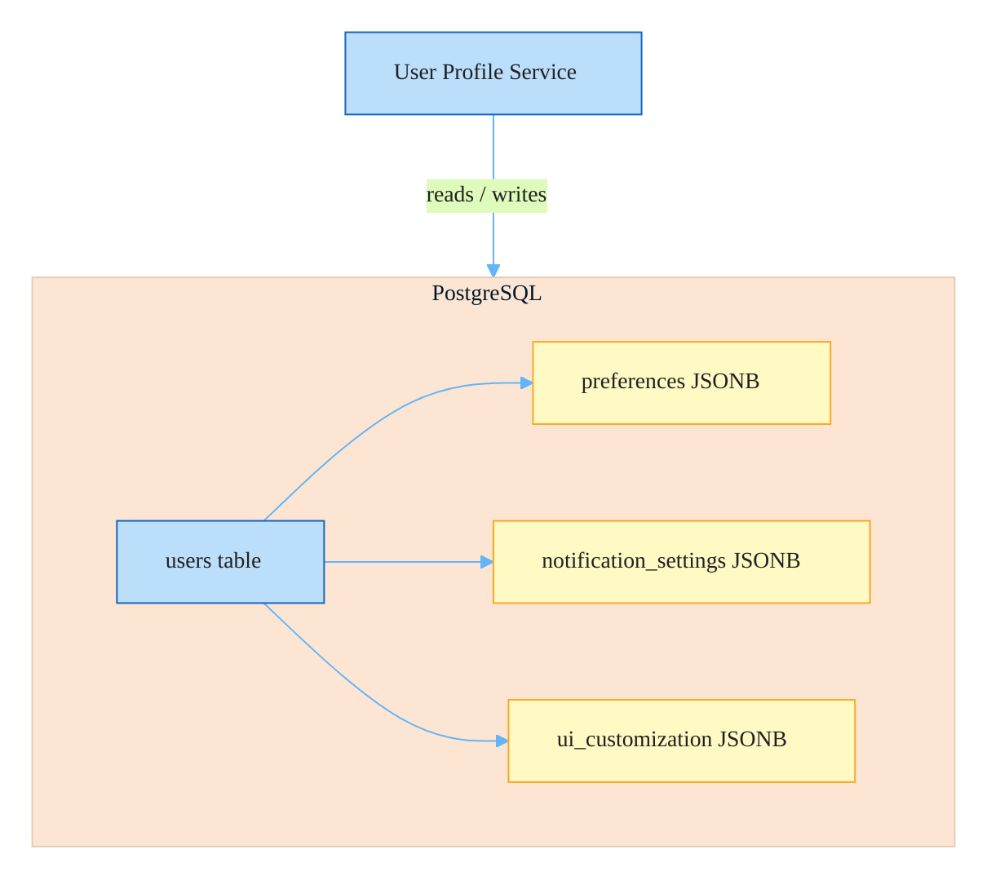
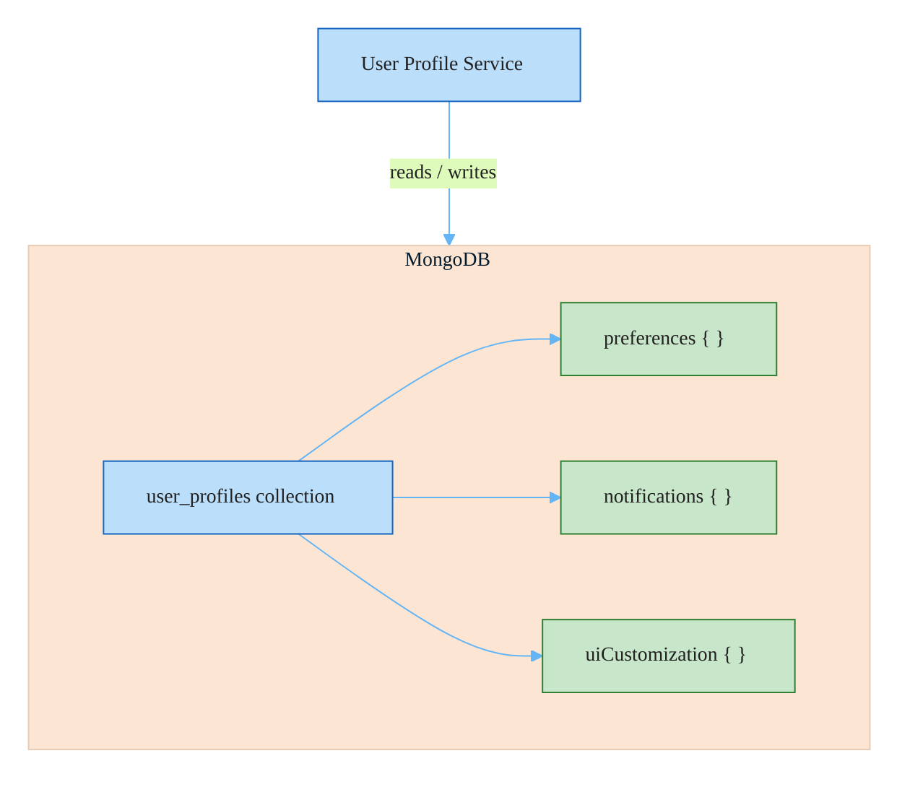

# RFC-001: Replace PostgreSQL with MongoDB for User Profile Service

**ID**: RFC-001
**Status**: In Review
**Proposed by**: Engineering
**Created**: 2026-04-19
**Last Updated**: 2026-04-19
**Targets**: Implementation, ADR

## Problem / Motivation

The user profile service stores increasingly complex nested data — preferences, notification settings, UI customization. The relational model is forcing artificial normalization: roughly half the fields already live in PostgreSQL JSONB columns. This causes:

- **Slow queries**: JSONB columns lack proper indexing (no GIN indexes), making predicate pushdown and partial reads expensive
- **Schema friction**: Nested document structures require awkward relational mapping and manual serialization
- **Impedance mismatch**: Profile data is document-shaped; forcing it into rows adds query complexity with no relational benefit
- **Maintenance burden**: JSONB columns bypass schema validation and type safety enforced by the ORM

Continuing on PostgreSQL means accepting escalating query complexity and performance degradation as profiles grow more complex.

## Goals and Non-Goals

### Goals

- Replace PostgreSQL with MongoDB as the data layer for the user profile service
- Store profile data as native MongoDB documents with nested fields for preferences, notification settings, and UI customization
- Migrate existing profile data from PostgreSQL to MongoDB with zero data loss
- Maintain the existing user profile API contract — no changes to request/response shapes visible to consumers
- Establish a validated migration runbook with rollback capability at each phase

### Non-Goals

- Migrating other services (auth, billing, orders) off PostgreSQL
- Changing the user profile REST or GraphQL API schema
- Real-time bidirectional sync between datastores beyond the dual-write migration window
- Introducing MongoDB for any service other than user profiles
- Adding new profile fields or capabilities as part of this change

## Proposed Solution

Migrate the user profile service data layer from PostgreSQL to MongoDB using a phased dual-write migration.

### Document Model

Profile documents use MongoDB's native nested document structure:

```json
{
  "_id": "uuid",
  "userId": "uuid",
  "preferences": {
    "language": "en",
    "timezone": "UTC",
    "theme": "dark"
  },
  "notifications": {
    "email": { "enabled": true, "digest": "daily" },
    "push": { "enabled": false }
  },
  "uiCustomization": {
    "sidebar": "collapsed",
    "density": "compact",
    "pinnedViews": ["dashboard", "reports"]
  },
  "updatedAt": "2026-04-19T00:00:00Z"
}
```

### Migration Phases

1. **Stand up MongoDB** alongside PostgreSQL — no traffic yet
2. **Dual-write**: all profile writes go to both stores; reads still from PostgreSQL
3. **Backfill**: migrate existing profiles from PostgreSQL to MongoDB; verify record counts and spot-check documents
4. **Shadow reads**: read from MongoDB, compare against PostgreSQL for a validation period; alert on divergence
5. **Cutover**: switch reads and writes to MongoDB only
6. **Decommission**: drop user profile tables from PostgreSQL after a burn-in period (minimum 2 weeks)

### Architecture

**Before**



**After**



## Alternatives

### Optimize PostgreSQL JSONB with GIN Indexes

Add GIN indexes on JSONB columns, restructure queries to use native JSONB operators (`@>`, `?`, `#>`), and potentially split large JSONB blobs into purpose-specific columns with targeted indexes.

**Pros**: No migration risk, no new datastore to operate, leverages existing team expertise in PostgreSQL, likely addresses the immediate query performance problem with low effort.
**Cons**: Still working within relational constraints for inherently document-shaped data; as profile complexity increases, the impedance mismatch will resurface; JSONB remains a second-class citizen in the schema.
**Rejected because**: GIN indexes address symptoms rather than the root structural mismatch. Profile data will continue growing in complexity — more nested fields, optional sub-documents, variable-length arrays. PostgreSQL can accommodate this, but at the cost of increasingly awkward query patterns. MongoDB's native document model removes this ceiling.

### Hybrid — PostgreSQL for Identity + MongoDB for Profiles

Keep core relational fields (user ID, created_at, auth metadata) in PostgreSQL. Move preference documents, notification settings, and UI customization to MongoDB. The service layer abstracts the split.

**Pros**: Relational data stays relational; document data uses native document storage. Clean conceptual separation between identity and preference data.
**Cons**: Two operational datastores for a single service domain; cross-store lookups require application-layer joins; distributed state consistency becomes a concern (e.g., profile created in Mongo but user deleted from Postgres); doubles operational surface for the profile service team.
**Rejected because**: The profile service has a clear, cohesive domain boundary. The "relational" fields that would stay in PostgreSQL (userId, timestamps) are trivially representable in MongoDB. The hybrid adds operational burden — two connection pools, two backup strategies, two failure modes — without meaningful benefit over a clean MongoDB migration.

## Impact

- **Files / Modules**: `services/user-profile/`, `db/migrations/`, `infra/mongodb/`
- **C4**: Container diagram update required — User Profile Service dependency changes from PostgreSQL to MongoDB
- **ADRs**: Record decision to use MongoDB for document-shaped service data (profile preferences, notification settings, UI customization)
- **Breaking changes**: No — API contract is unchanged; this is an internal data layer change

## Open Questions

- [ ] **Must resolve before acceptance**: What is the acceptable downtime window (if any) for the migration cutover? Phase 4 (shadow reads) requires running both stores simultaneously.
- [ ] **Must resolve before acceptance**: Does the team have MongoDB operational expertise — monitoring, index management, backup strategy, connection pooling? If not, is Atlas (managed) acceptable?
- [ ] **Can defer to implementation**: Should MongoDB schema validation be enforced at the database level (JSON Schema validator) or application layer only?
- [ ] **Can defer to implementation**: What is the rollback trigger — specific error rate threshold, latency SLO breach, or manual decision?

---

## Change Log

- 2026-04-19: Initial draft — Approach A (full MongoDB migration) selected
- 2026-04-19: Status → In Review
