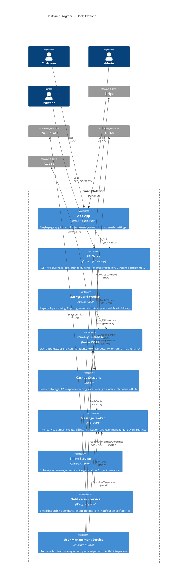

# C4 Level 2: Container Diagram

## Notes

- **API Server** is the main entry point for all client requests — handles versioning (ADR-001), rate limiting, auth middleware
- **RabbitMQ** added per ADR-002 for billing/notification/user management decoupling
- **Redis** serves triple duty: session store, cache, and Bull job queue backing store
- **Django services** (billing, notifications, user management) extracted from the original monolith — each has its own schema in the shared PostgreSQL instance
- **Background Worker** handles long-running tasks: report generation, CSV exports, webhook retries
