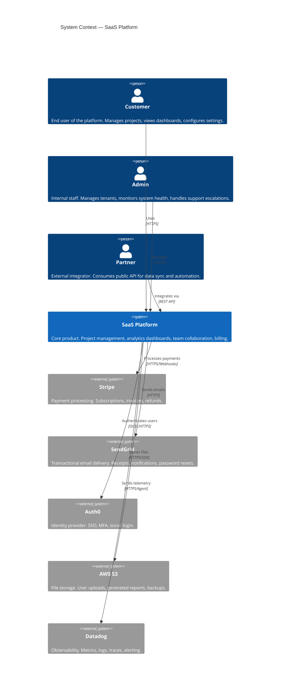

# C4 Level 1: System Context

## Notes

- **Customers** interact via web browser (React SPA) and mobile apps
- **Partners** use the public REST API (v1, versioned per ADR-001)
- **Auth0** handles all authentication — platform never stores passwords
- **Stripe** is the single payment provider — no direct credit card handling
