# Diagram Type Reference

Type-specific Mermaid syntax. Read the section for the diagram type you are generating.

---

## Flowchart

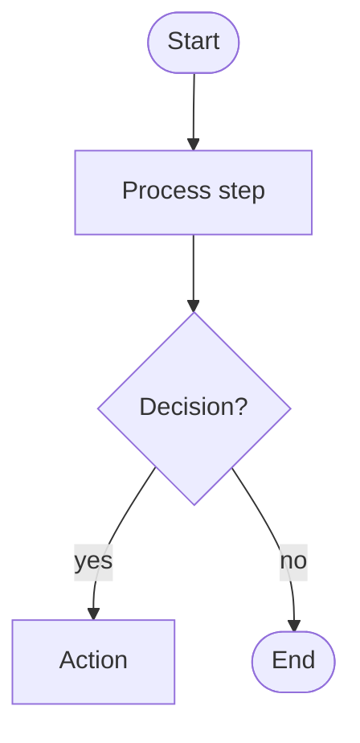

- Orientations: `TD` (top-down), `LR` (left-right), `BT`, `RL`
- Shapes: `[rect]`, `(round)`, `([stadium])`, `{diamond}`, `[(cylinder)]`, `[[subroutine]]`, `{{hexagon}}`, `>asymmetric]`, `[/parallelogram/]`
- Subgraphs: `subgraph id [title] ... end`
- Links: `-->`, `---`, `-.->`, `==>`, `--text-->`, `-->|text|`

---

## Sequence Diagram

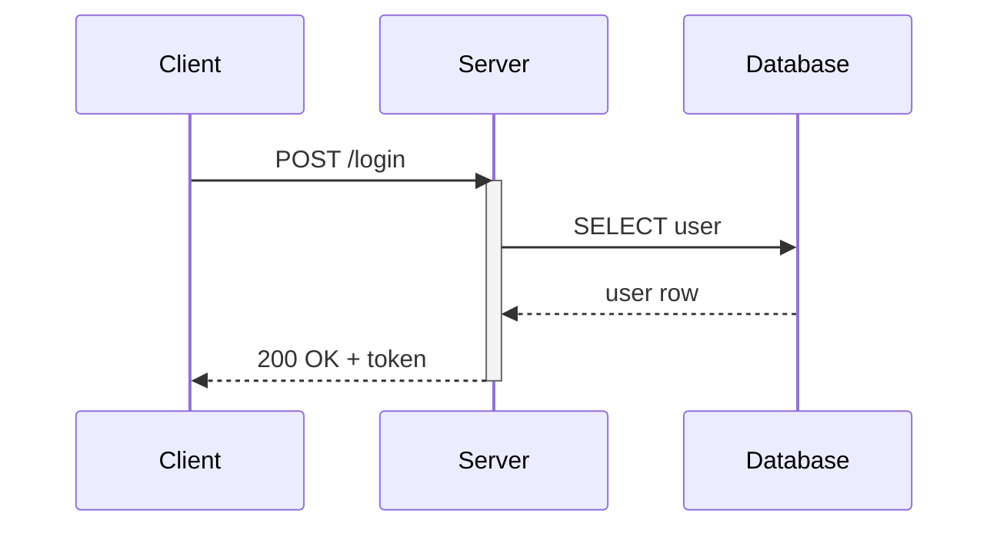

- Use short aliases: `participant C as Client`
- Sync: `->>`, response: `-->>`, open: `->`
- `activate`/`deactivate` for lifelines
- `rect rgb(...)` for grouping
- `Note over A,B: text` for annotations
- `alt`/`else`/`end` for conditionals, `loop`/`end` for loops
- Max 6 participants before splitting

---

## State Diagram

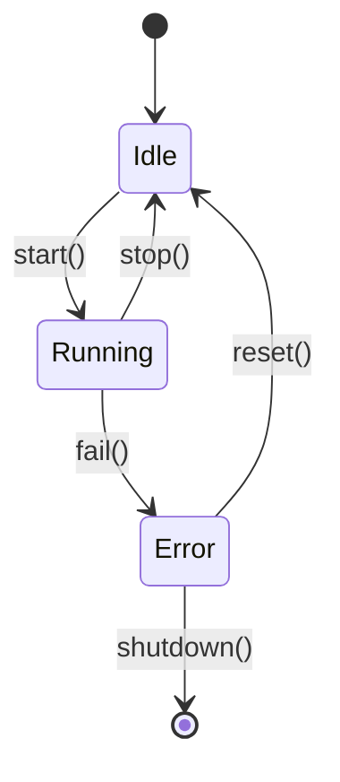

- `state "Label" as id` for readable names
- Composite: `state "Group" as g { inner1 --> inner2 }`
- Terminals: `[*] -->` (start), `--> [*]` (end)
- `<<fork>>` and `<<join>>` for parallel states

---

## ER Diagram

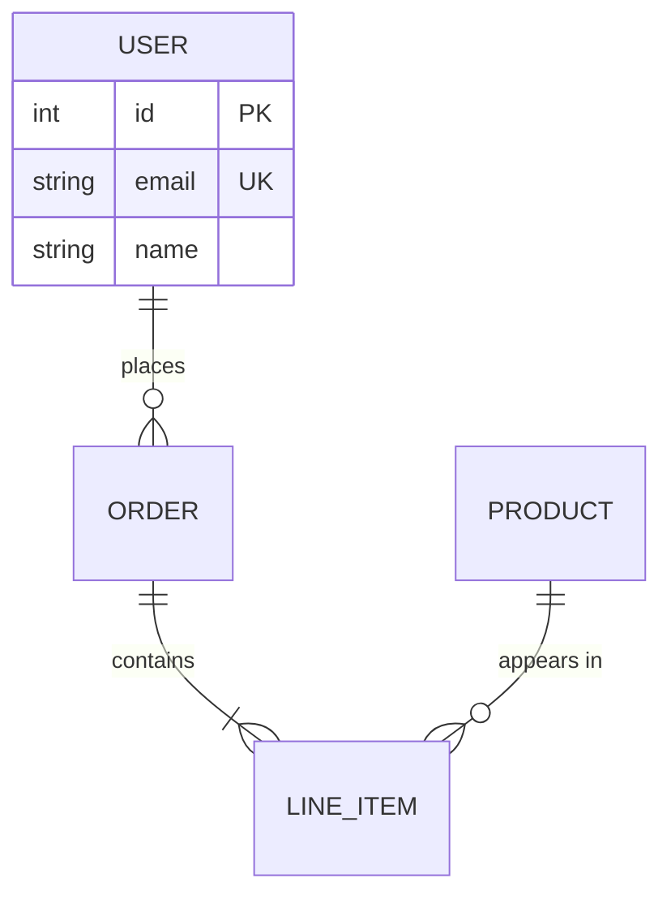

- Cardinality: `||` exactly one, `o|` zero or one, `|{` one+, `o{` zero+
- Show PK/FK/UK only — omit low-value attributes
- Relationship labels in quotes

---

## Class Diagram

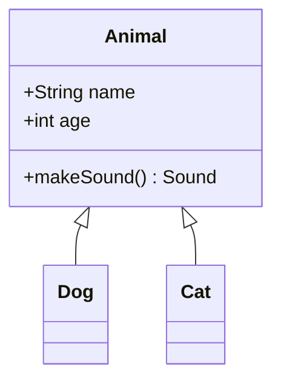

- Visibility: `+` public, `-` private, `#` protected, `~` package
- Relationships: `<|--` inheritance, `*--` composition, `o--` aggregation, `-->` association, `..>` dependency, `..|>` realization
- Annotations: `<<interface>>`, `<<abstract>>`, `<<enumeration>>`
- **`classDef` application must be inline** — use `class ClassName:::classDefName { ... }`, not standalone `ClassName:::classDefName` lines (those cause parse errors)

---

## Gantt Chart

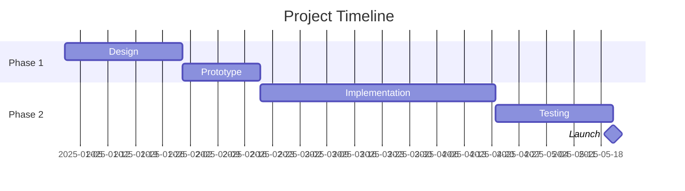

- `dateFormat` must be first
- Group with `section`
- Dependencies: `after taskId`
- Milestones: `:milestone, after X, 0d`
- Status modifiers: `done`, `active`, `crit`

---

## Pie Chart

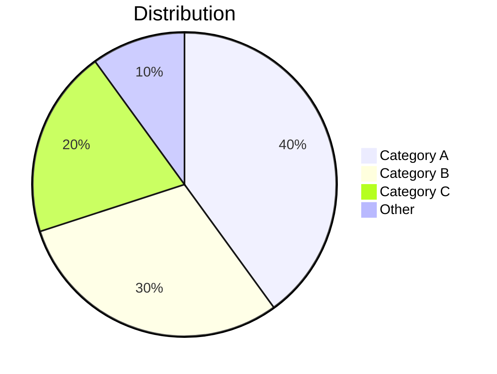

- Values are proportional, not required to sum to 100
- Keep to 6–8 slices; group small ones into "Other"

---

## Mindmap

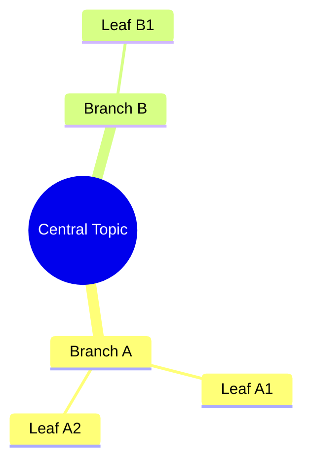

- Indentation defines hierarchy
- Root shapes: `((circle))`, `[square]`, `(rounded)`
- Keep to 3–4 levels deep; short labels

---

## Timeline

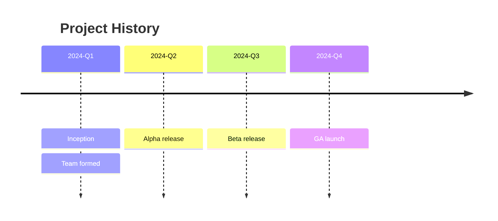

- Time period on its own line; events indented with `:`
- Multiple events per period are allowed

---

## Quadrant Chart

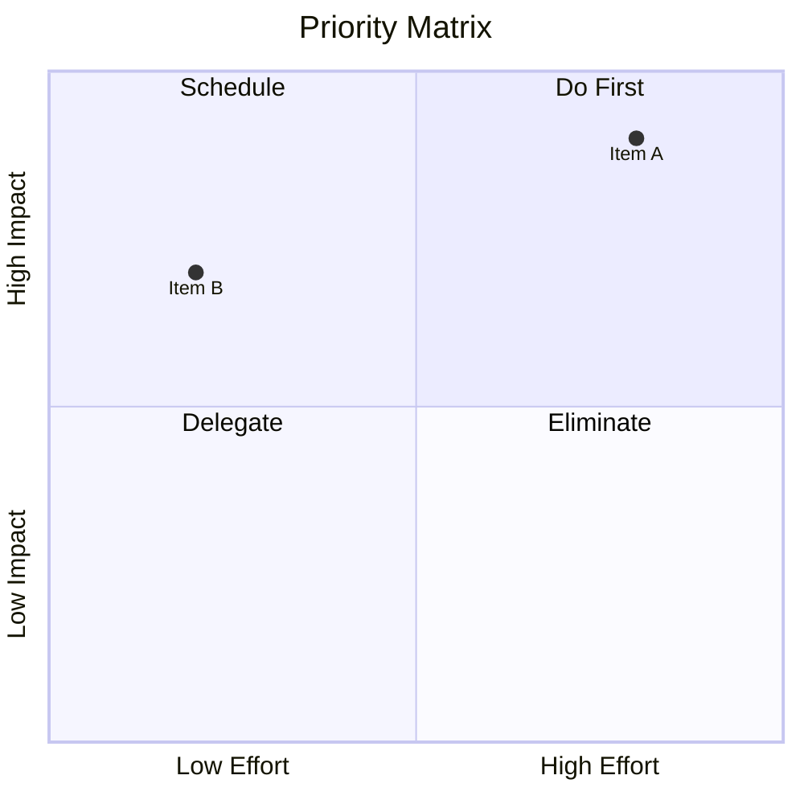

- Quadrants: 1=top-right, 2=top-left, 3=bottom-left, 4=bottom-right
- Points: `Label: [x, y]` with 0.0–1.0 coordinates

---

## Sankey Diagram (`sankey-beta`)

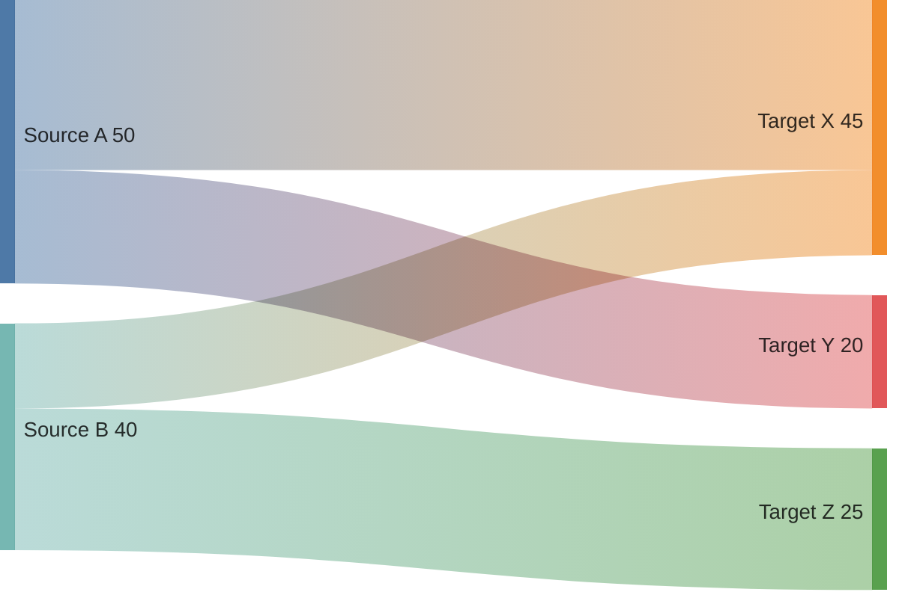

- CSV format: `source,target,value`
- Values control flow width
- Keep to ~10–15 flows for readability

---

## Git Graph

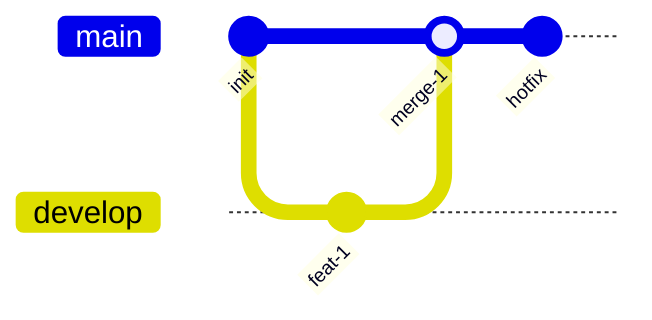

- `branch name`, `checkout name`, `merge name`
- Tags: `commit id: "v1.0" tag: "v1.0"`
- `cherry-pick id: "id"`

---

## C4 Diagrams

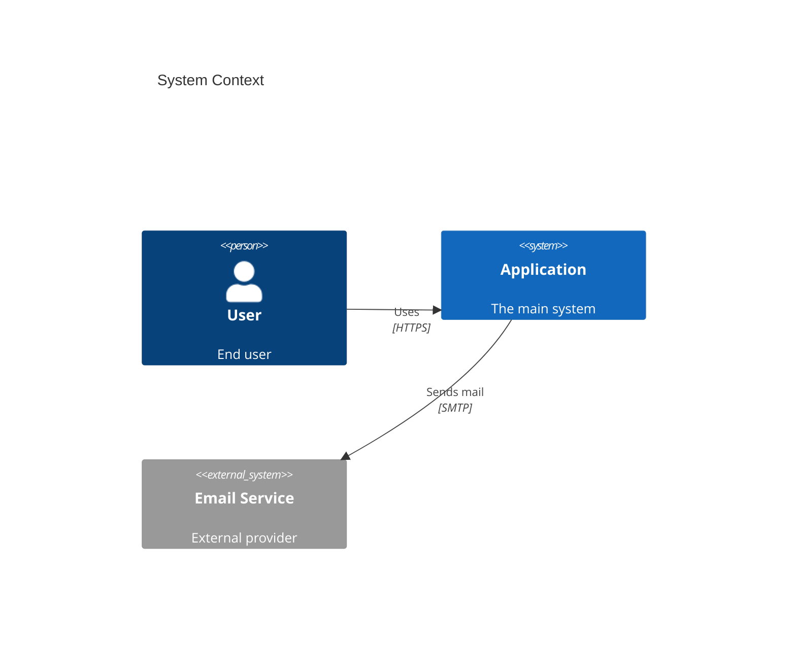

- Types: `C4Context`, `C4Container`, `C4Component`, `C4Dynamic`
- Elements: `Person()`, `System()`, `System_Ext()`, `Container()`, `Component()`
- Boundaries: `Boundary(id, "Label") { ... }`
- One C4 level per diagram
- **Arrow routing**: C4 uses a grid layout. On hub-and-spoke patterns arrows often route through other nodes. Add `UpdateLayoutConfig($c4ShapeInRow="3", $c4BoundaryInRow="1")` right after the `title` line to control elements per row — tuning this value spreads nodes out and gives arrows cleaner paths. If crossings persist, split into two diagrams (users→system, system→external services).

---

## Block Diagram (`block-beta`)

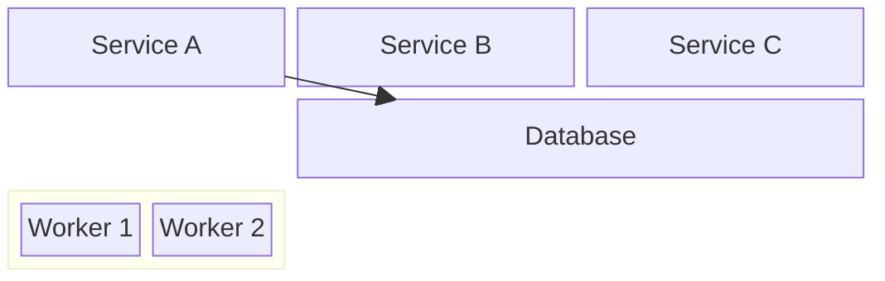

- `columns N` sets grid width; `:N` spans N columns
- `space` for empty cells
- `block:id ... end` for nested containers
- **Styling nodes**: `classDef`/`:::` is not supported inside nested `block:...:end` containers. Use `style nodeId fill:...,stroke:...,color:...` statements after all `end` keywords instead.
- **When to avoid `block-beta`**: it uses a fixed grid layout — blocks size unpredictably and edge routing is poor (arrows pass through nodes). If the diagram has connections between nodes, use `flowchart TD/LR` with `subgraph` boundaries instead, which gives proper edge routing and predictable sizing. Reserve `block-beta` for static layout diagrams with no or very few arrows.

---

## Architecture Diagram (`architecture-beta`)

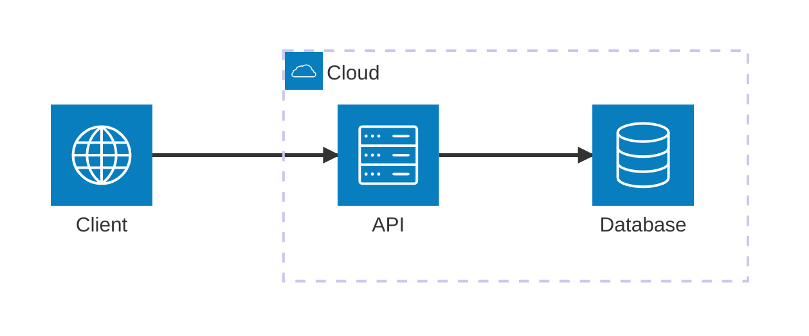

- `group id(icon)[Label]` for boundaries
- `service id(icon)[Label] in group`
- Icons: `cloud`, `server`, `database`, `internet`, `disk`
- Connections use edge anchors: T, B, L, R
- **Label restriction:** Labels must contain only alphanumeric characters and spaces — no `.`, `-`, `/`, `[`, `]`, or other punctuation. `Node.js` → `NodeJS`, `ECS - API` → `ECS API`. If labels require special characters, use `flowchart TD` with `subgraph` for the boundary instead.

---

## Packet Diagram (`packet-beta`)

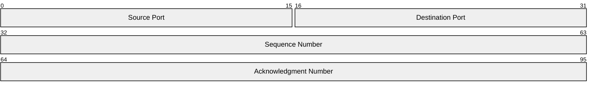

- `start-end: "Label"` for each field
- Rows wrap at 32 bits by default

---

## Kanban Board

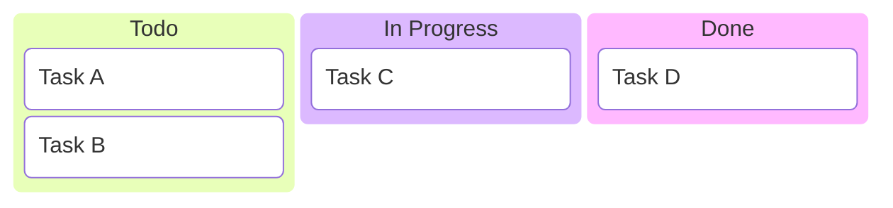

- Column names as top-level items, tasks indented under columns

---

## XY Chart (`xychart-beta`)

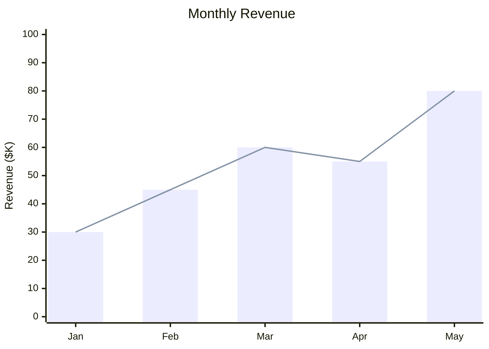

- `bar [values]` and/or `line [values]`
- Keep data points under ~15

---

## Requirement Diagram

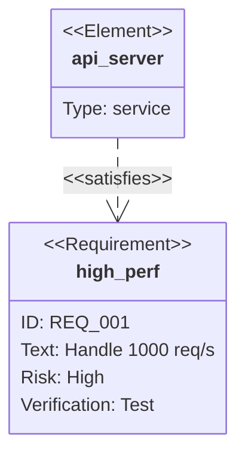

- Types: `requirement`, `functionalRequirement`, `performanceRequirement`, `interfaceRequirement`, `designConstraint`, `physicalRequirement`
- Risk: `low`, `medium`, `high`
- Verify: `analysis`, `inspection`, `test`, `demonstration`
- Relations: `satisfies`, `traces`, `contains`, `derives`, `refines`, `copies`
- **`text:` field is plain text only** — no ` `, HTML, or special characters. Keep it to one concise sentence.
- **Avoid hyphens everywhere** — hyphens in identifiers, `id:` values, or node names are parsed as relation arrow tokens and cause parse errors. Use underscores instead (`REQ_001`, `auth_service`, not `REQ-001`, `auth-service`).

---

## Journey Diagram

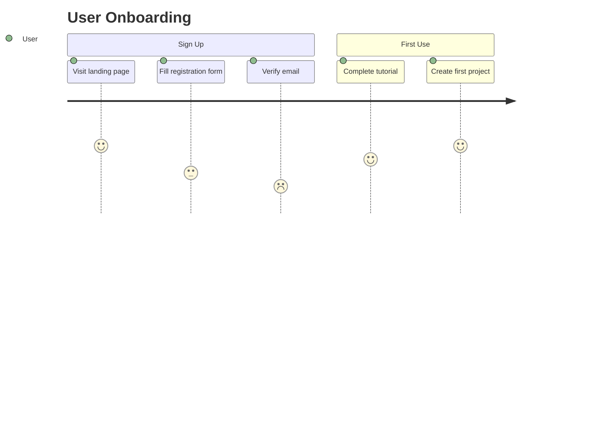

- Format: `Task name: satisfaction(1–5): actor`
- Higher number = better satisfaction
- Group with `section`
