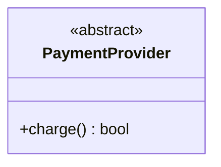
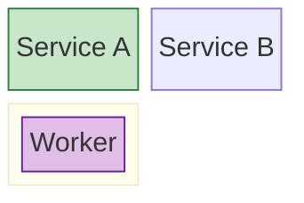

# Styling Guide

How to apply Material Design colors across different diagram types.

---

## Color Reference

| Color  | Fill / Border         | Semantic use                                |
|--------|-----------------------|---------------------------------------------|
| Blue   | `#BBDEFB` / `#1565C0` | Default nodes, main path (applied by theme) |
| Green  | `#C8E6C9` / `#2E7D32` | Success states, completions, approvals      |
| Pink   | `#F8BBD0` / `#AD1457` | Errors, failures, warnings, rejections      |
| Purple | `#E1BEE7` / `#6A1B9A` | External systems, third-party services      |
| Yellow | `#FFF9C4` / `#F9A825` | Notes, pending states, caution              |
| Grey   | `#F5F5F5` / `#616161` | Disabled, deprecated, background elements   |

Apply colors only to nodes with a clear semantic role. Leave neutral/default nodes unstyled — the theme's blue is their default.

---

## By Diagram Type

### `flowchart` — use `classDef` + `:::` syntax

```mermaid
%%{init: ...}%%   ← verbatim from assets/material-theme.txt

flowchart TD
    classDef ok fill:#C8E6C9,stroke:#2E7D32,color:#212121
    classDef err fill:#F8BBD0,stroke:#AD1457,color:#212121
    classDef ext fill:#E1BEE7,stroke:#6A1B9A,color:#212121
    classDef warn fill:#FFF9C4,stroke:#F9A825,color:#212121

    start([User Submits]) --> check{Account Exists?}
    check -->|no| notfound[Account Not Found]:::err
    check -->|yes| auth[Authenticate via OAuth]:::ext
    auth -->|success| dashboard([Dashboard]):::ok
    auth -->|failure| fail[Show Error Message]:::err
```

### `stateDiagram-v2` — use `classDef` + `:::` syntax

Same `classDef` / `:::` approach as flowchart. Apply to individual state names.

### `sequenceDiagram` — use `rect rgb(...)` blocks

`classDef` is not supported. Use colored `rect` blocks to highlight groups of messages:


Color values mapped to the palette:

- Green success: `rgb(200,230,201)`
- Pink error: `rgb(248,187,208)`
- Purple external: `rgb(225,190,231)`
- Yellow caution: `rgb(255,249,196)`

### `classDiagram` — limited support

`classDef` application must be inline:



Standalone `PaymentProvider:::ext` lines outside a class body cause parse errors.

### `erDiagram`, `gantt`, `pie`, `mindmap`, `timeline`, `quadrant`, `sankey-beta`, `gitGraph`, `xychart-beta`, `packet-beta`, `kanban`, `journey`

These types do not support `classDef` / `:::`. Leave unstyled — the theme `%%{init}%%` block provides consistent background colors and fonts. No per-node semantic coloring is needed.

### `C4Context` / `C4Container` / `C4Component`

External systems (`System_Ext`) are automatically styled differently by C4. No additional coloring needed.

### `requirementDiagram`

No styling support. Plain text output only.

### `architecture-beta`

No `classDef` support. Use `style` if needed (limited support varies by renderer).

### `block-beta`

`classDef`/`:::` not supported inside nested `block:...:end` containers. Use `style nodeId fill:...,stroke:...,color:...` statements after all `end` keywords:


