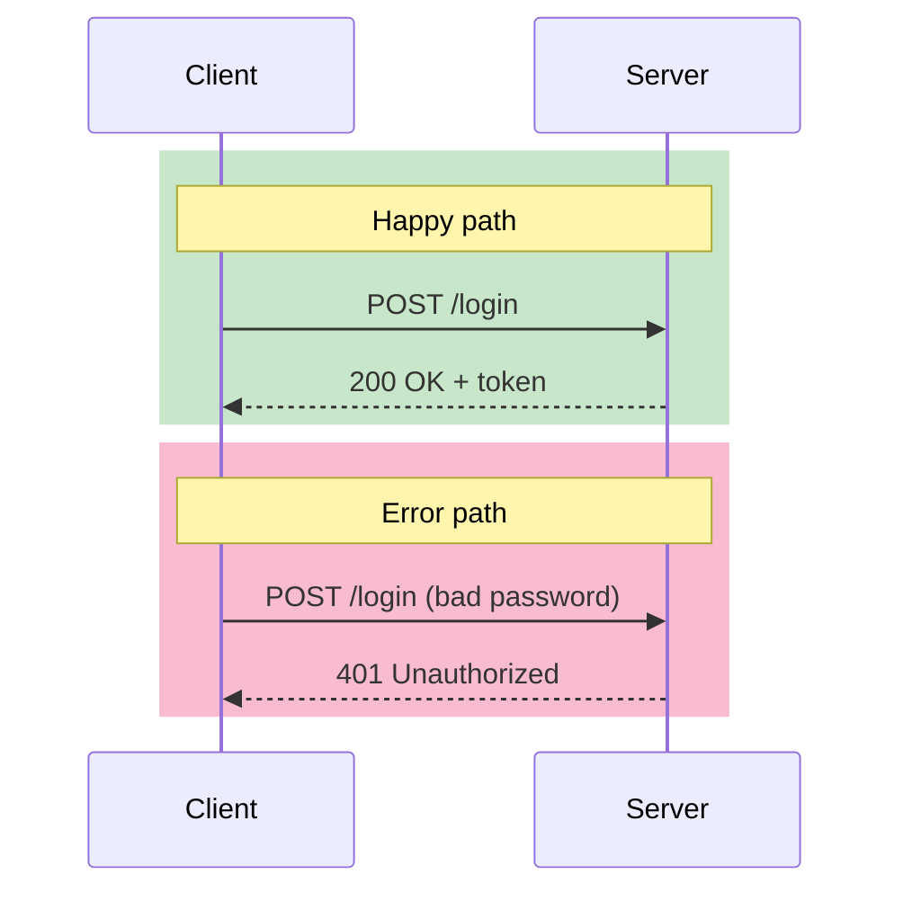
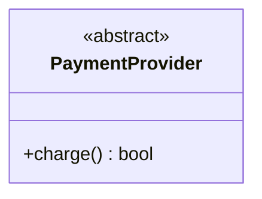
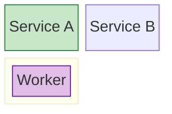

# Styling Guide

Per-type coloring syntax. Colors and semantics defined in SKILL.md.

## No Styling Support

`erDiagram`, `gantt`, `pie`, `mindmap`, `timeline`, `quadrant`, `sankey-beta`, `gitGraph`, `xychart-beta`, `packet-beta`, `kanban`, `journey`, `requirementDiagram` — leave unstyled. Theme `%%{init}%%` block handles colors and fonts.

## `flowchart`, `stateDiagram-v2` — `classDef` + `:::`

Use `classDef` declarations + `:::` on nodes (see SKILL.md example).

## `sequenceDiagram` — `rect rgb(...)` blocks

`classDef` not supported. Use colored `rect` blocks:

RGB values: green `rgb(200,230,201)`, pink `rgb(248,187,208)`, purple `rgb(225,190,231)`, yellow `rgb(255,249,196)`

### `classDiagram` — inline only

Standalone `ClassName:::classDefName` outside class body → parse error.

### `block-beta` — `style` after `end`

`classDef`/`:::` not supported inside nested `block:...:end`. Use `style` after all `end` keywords:

### `architecture-beta`

No `classDef`. Use `style` if needed (renderer support varies).

### `C4Context` / `C4Container` / `C4Component`

`System_Ext` auto-styled by C4. No additional coloring needed.

