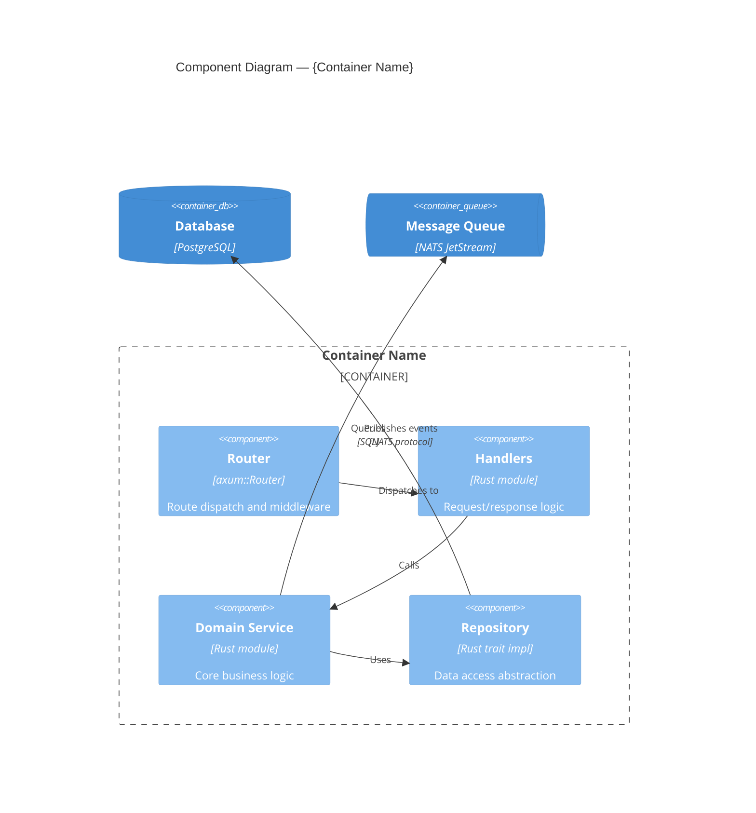

# C4 Level 3 — Component: {Container Name}

| Level     | Status | Author | Created      | Last Updated |
|-----------|--------|--------|--------------|--------------|
| Component | Draft  | {name} | {YYYY-MM-DD} | {YYYY-MM-DD} |

## Component Diagram

## Legend

- **`Component(...)`** — Module, class group, or service layer (with technology label)
- **`ContainerDb(...)`** — External data store
- **`ContainerQueue(...)`** — External message queue

## Notes

- **Responsibilities**: What each component does and its boundaries
- **Key interfaces**: Traits, module visibility, and abstraction boundaries
- **Design decisions**: Why components are structured this way

## References

- Related PRDs, RFCs, ADRs
