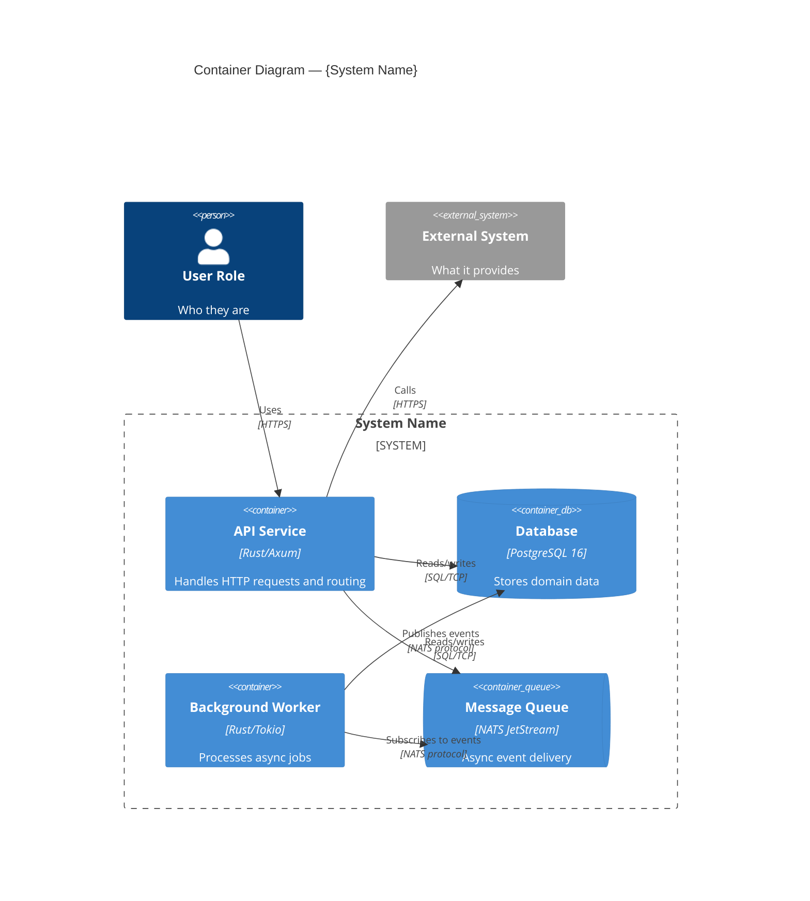

# C4 Level 2 — Container: {System Name}

| Level     | Status | Author | Created      | Last Updated |
|-----------|--------|--------|--------------|--------------|
| Container | Draft  | {name} | {YYYY-MM-DD} | {YYYY-MM-DD} |

## Container Diagram

## Legend

- **`Container(...)`** — Application or service (with technology label)
- **`ContainerDb(...)`** — Data store
- **`ContainerQueue(...)`** — Message queue or event bus
- **`System_Ext(...)`** — External system outside the boundary

## Notes

- **Technology choices**: Why each container uses its specific technology
- **Communication**: How containers talk to each other (sync HTTP, async messaging, shared DB)
- **Data ownership**: Which container owns which data

## References

- Related PRDs, RFCs, ADRs
