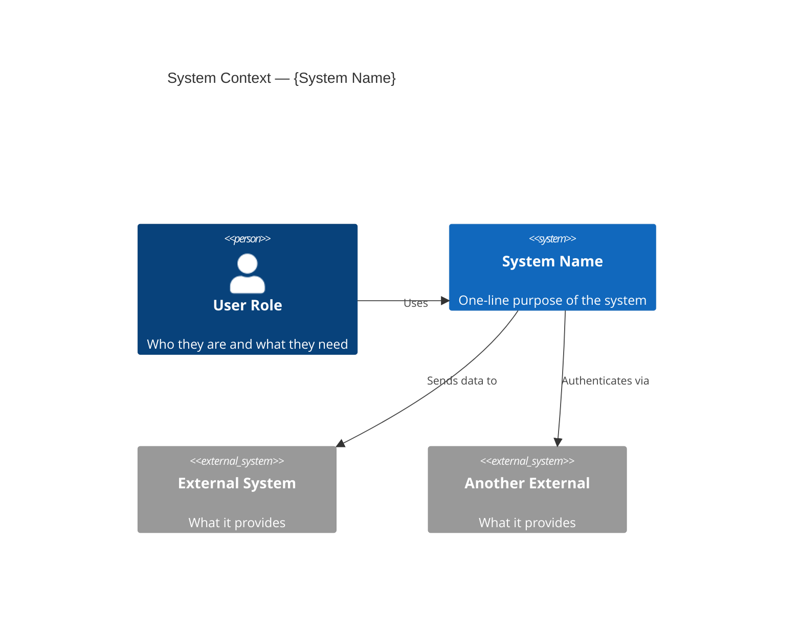

# C4 Level 1 — System Context: {System Name}

| Level   | Status | Author | Created      | Last Updated |
|---------|--------|--------|--------------|--------------|
| Context | Draft  | {name} | {YYYY-MM-DD} | {YYYY-MM-DD} |

## System Context

## Legend

- **`Person(...)`** — Human actor or user role
- **`System(...)`** — The system being documented
- **`System_Ext(...)`** — External system outside the boundary

## Notes

- **Users/Actors**: Who interacts with this system, their role, and their goal
- **External dependencies**: What systems does this depend on? What happens if they're unavailable?
- **Trust boundaries**: Where do trust levels change (e.g., public internet → internal network)?

## References

- Related PRDs, RFCs, ADRs
